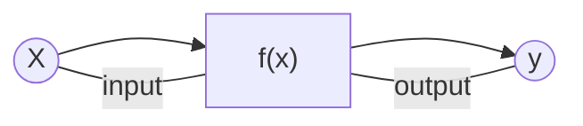
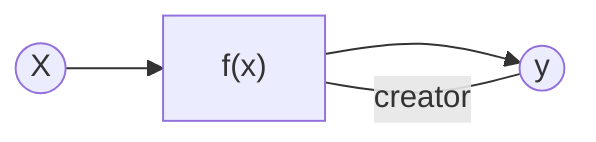
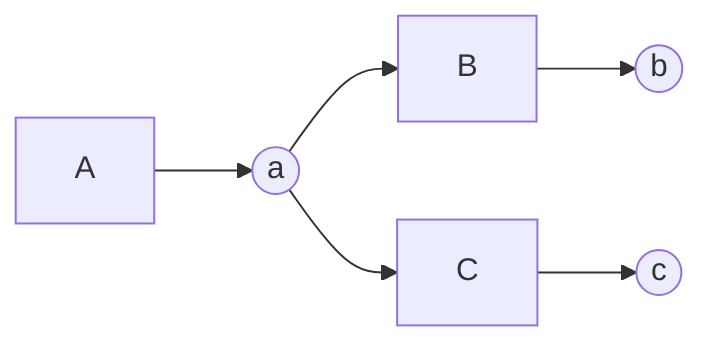

# 微分の実装（自動化）
前の段階で微分を実装することができました。しかし逆伝播の計算を自分自身で書く必要があります。今回は関数が3つの単純な関数でしたが、これが100、200個と、長い計算グラフを考えたとき**x.grad =・・・** という逆伝播のコードを数百個すべて手作業で書かなくてはなりません。この章では順伝播の関数に対する逆伝播が自動的に行われる仕組みを作ります。

## 微分自動化のための変更点
微分を自動化するためには、変数と関数の「**つながり**」について考えなければなりません。手動で微分したコードでは人が自分たちでgradの値を変更していたため、つながりを考えなくても正しく微分できました。しかし、自動化するにあたって、このつながりを正しくさかのぼる必要があります。**正しく遡るにあたって、変数と関数がどのようにつながっているか間違えることのないよう正しく保存しておかなくてはなりません。**

関数の目線から変数がどのようにみえるかというと、変数は「入力される変数」と「出力される変数」の２種類存在します。

関数の目線から変数がどのようにみえるかというと、変数は「入力される変数」と「出力される変数」の２種類存在します。



続いて、逆に変数の目線から関数がどう見えるのか考えてみましょう。ここで注目すべき点は「**関数の作成**」の章で言ったように変数は関数によって作り出されるということです。**関数**は変数を入力として関数に渡し、出力として新たな変数を生み出します。言い換えると変数にとって関数は「creator（生みの親）」です。




ではその関数と変数の「つながり」を私たちのコードに取り入れましょう。

```rust
struct Variable {
    data: f32,
    grad: Option<f32>,
    creator: Option<Rc<RefCell<dyn Functions>>>,
    name: Option<String>,
}

impl Variable {
    fn new(data: f32) -> Rc<RefCell<Self>> {
        Rc::new(RefCell::new(Variable {
            data,
            grad: None,
            creator: None,
            name: None,
        }))
    }
    fn set_creator(&mut self, func: &Rc<RefCell<dyn Functions>>) {
        self.creator = Some(Rc::clone(func));
    }
}
```

このコードを説明する前にRc<RefCell>型について説明します。
通常Rustの所有権の考え方では、データは一度に一つの変数しか所有できません。今までは一変数の関数のみを扱ってきたので、所有権の扱いは簡単でした。しかし、これからいろいろな関数(多変数関数)を実装していく中で、複雑な関数も実装するためRustの所有権を管理するのが大変になってきます。なので共同保有という考え方をVariable構造体に導入します。  



上の計算グラフの場合を考えてみましょう。この関数では関数Aを用いて変数aを作り出し、関数Bが変数aを参照し変数bを、関数Cが変数aを参照し変数cを作り出しています。ここで重要なのは関数Bと関数Cがどちらとも変数aという１つの変数を参照していることです。  

これを解決するためにRustはClone()というトレイトを実装しています。このトレイトは新しいメモリを確保し、完全なコピーをします。しかし私たちが作るフレームワークは複雑な関数を何度も使用するため、毎回コピーすると処理が重く、メモリも莫大に必要になってきます。

Rcは「参照カウント」型で複数の所有者を可能にしますが内部のデータへの不変な参照しか提供しません。RefCellはborrow_()、borrow_mut()によって、実行時における可変性（Interior Mutability）を可能にします。つまりRc<RefCell>型は所有権の共有と内部のデータを可変に操作できるというRustでは難しい特徴を両立できる型なのです。まとめると、Rc型は所有権の共同保有を、Refcell型は共同保有されたものを可変に扱うことを可能にしているのです。

Variable構造体に**Rc<'RefCell'>** を導入すると、**Rc<Refcell<'Variable'>>** 構造体となります。これはもとのVariable構造体を可変な共同保有ができるようにしたものです。しかし、Variableの内部のデータにアクセスするにはborrow()を多用しなければなりません。またこの構造体を型で示すとき、毎回、Rc<RefCell<'Variable'>>と書かなくてはならず、面倒です。そこでこのRc<Refcell<'Variable'>>構造体を一つの構造体として実装してみましょう。ここではRc型を用いているのでRcVariable型とします。

では可変な参照の共有ができるRc<'Refcell'>型を用いて**RcVariable構造体** を実装してみましょう。
>ここで用いるRc、RefCellはRustの中でも扱いが難しい概念です。特にborrow()関数などは扱い方を知らないと簡単にエラーが起きます。なので事前に調べておくことをお勧めします。これらの参考資料はGitHubのreadmeから見ることもできます。

```rust
struct Variable {
    data: f32,
    grad: Option<f32>,
    creator: Option<Rc<RefCell<dyn Function>>>,
    name: Option<String>,
}

impl Variable {
　　fn new_rc(data: f32) -> Rc<RefCell<Self>> {
        Rc::new(RefCell::new(Variable {
            data: data,
            grad: None,
            creator: None,
            name: None,
            id: id_generator(),
        }))
    }

    fn set_creator(&mut self, func: &Rc<RefCell<dyn Function>>) {
        self.creator = Some(Rc::clone(func));
    }
}

#[derive(Debug, Clone)]
pub struct RcVariable(pub Rc<RefCell<Variable>>);

impl RcVariable {
    pub fn new(data: f32) -> Self {
        RcVariable(Variable::new_rc(data.to_owned()))
    }
   
    pub fn data(&self) -> f32 {
        self.0.borrow().data.clone()
    }

    pub fn grad(&self) -> Option<RcVariable> {
        self.0.borrow().grad.clone()
    }
    
}

trait Function{
    fn call(&mut self, input: &RcVariable) -> RcVariable;
    fn forward(&self, x: f32) -> f32; // 引数f32
    fn backward(&self, gy: f32) -> f32; // 引数f32
    fn get_input(&self) -> RcVariable;
    fn get_output(&self) -> RcVariable;
}
```

- pub fn new_rc(data: f32)  
初期化したRcVariableを呼び出す関数。前のVariableを生成するnew()とは別物なので注意。

- self.0.borrow_mut()  
可変借用を取得し、内部のVariableに対してbackwardメソッドを呼び出すことで勾配情報を更新している。
