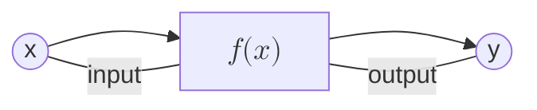
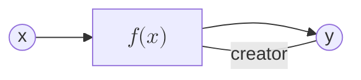
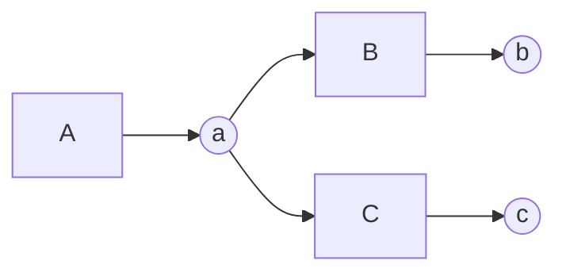
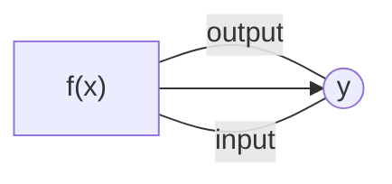
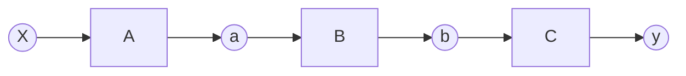
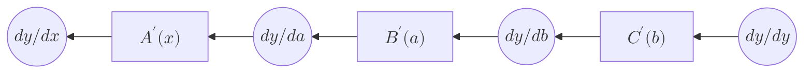
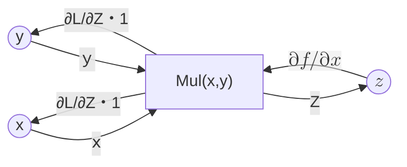

# 微分の実装（自動化）
前の段階で微分を実装することができました。しかし逆伝播の計算を自分自身で書く必要があります。今回は関数が3つの単純な関数でしたが、これが100、200個と、長い計算グラフを考えたとき**x.grad =・・・** という逆伝播のコードを数百個すべて手作業で書かなくてはなりません。この章では順伝播の関数に対する逆伝播が自動的に行われる仕組みを作ります。

## 微分自動化のための変更点
微分を自動化するためには、変数と関数の「**つながり**」について考えなければなりません。手動で微分したコードでは人が自分たちでgradの値を変更していたため、つながりを考えなくても正しく微分できました。しかし、自動化するにあたって、このつながりを正しくさかのぼる必要があります。**正しく遡るにあたって、変数と関数がどのようにつながっているか間違えることのないよう正しく保存しておかなくてはなりません。**

関数の目線から変数がどのようにみえるかというと、変数は「入力される変数」と「出力される変数」の２種類存在します。



続いて、逆に変数の目線から関数がどう見えるのか考えてみましょう。ここで注目すべき点は「**関数の作成**」の章で言ったように変数は関数によって作り出されるということです。**関数**は変数を入力として関数に渡し、出力として新たな変数を生み出します。言い換えると変数にとって関数は「creator（生みの親）」です。




ではその関数と変数の「つながり」を私たちのコードに取り入れましょう。

```rust
struct Variable {
    data: f32,
    grad: Option<f32>,
    creator: Option<Rc<RefCell<dyn Functions>>>,
    name: Option<String>,
}

impl Variable {
    fn new(data: f32) -> Rc<RefCell<Self>> {
        Rc::new(RefCell::new(Variable {
            data,
            grad: None,
            creator: None,
            name: None,
        }))
    }
    fn set_creator(&mut self, func: &Rc<RefCell<dyn Functions>>) {
        self.creator = Some(Rc::clone(func));
    }
}
```

このコードを説明する前にRc<RefCell>型について説明します。
通常Rustの所有権の考え方では、データは一度に一つの変数しか所有できません。今までは一変数の関数のみを扱ってきたので、所有権の扱いは簡単でした。しかし、これからいろいろな関数(多変数関数)を実装していく中で、複雑な関数も実装するためRustの所有権を管理するのが大変になってきます。なので共同保有という考え方をVariable構造体に導入します。  



上の計算グラフの場合を考えてみましょう。この関数では関数Aを用いて変数aを作り出し、関数Bが変数aを参照し変数bを、関数Cが変数aを参照し変数cを作り出しています。ここで重要なのは関数Bと関数Cがどちらとも変数aという１つの変数を参照していることです。  

これを解決するためにRustはClone()というトレイトを実装しています。このトレイトは新しいメモリを確保し、完全なコピーをします。しかし私たちが作るフレームワークは複雑な関数を何度も使用するため、毎回コピーすると処理が重く、メモリも莫大に必要になってきます。

Rcは「参照カウント」型で複数の所有者を可能にしますが内部のデータへの不変な参照しか提供しません。RefCellはborrow_()、borrow_mut()によって、実行時における可変性（Interior Mutability）を可能にします。つまりRc<RefCell>型は所有権の共有と内部のデータを可変に操作できるというRustでは難しい特徴を両立できる型なのです。まとめると、Rc型は所有権の共同保有を、Refcell型は共同保有されたものを可変に扱うことを可能にしているのです。

Variable構造体に**Rc&lt;RefCell&gt;** を導入すると、**Rc<Refcell&lt;Variable&gt;>** 構造体となります。これはもとのVariable構造体を可変な共同保有ができるようにしたものです。しかし、Variableの内部のデータにアクセスするにはborrow()を多用しなければなりません。またこの構造体を型で示すとき、毎回、Rc<Refcell&lt;Variable&gt;>と書かなくてはならず、面倒です。そこでこのRc<Refcell&lt;Variable&gt;>構造体を一つの構造体として実装してみましょう。ここではRc型を用いているのでRcVariable型とします。

では可変な参照の共有ができるRc<'Refcell'>型を用いて**RcVariable構造体** を実装してみましょう。
>ここで用いるRc、RefCellはRustの中でも扱いが難しい概念です。特にborrow()関数などは扱い方を知らないと簡単にエラーが起きます。なので事前に調べておくことをお勧めします。これらの参考資料はGitHubのreadmeから見ることもできます。

```rust
struct Variable {
    data: f32,
    grad: Option<f32>,
    creator: Option<Rc<RefCell<dyn Function>>>,
    name: Option<String>,
}

impl Variable {
　　fn new_rc(data: f32) -> Rc<RefCell<Self>> {
        Rc::new(RefCell::new(Variable {
            data: data,
            grad: None,
            creator: None,
            name: None,
            id: id_generator(),
        }))
    }

    fn set_creator(&mut self, func: &Rc<RefCell<dyn Function>>) {
        self.creator = Some(Rc::clone(func));
    }
}

#[derive(Debug, Clone)]
pub struct RcVariable(pub Rc<RefCell<Variable>>);

impl RcVariable {
    pub fn new(data: f32) -> Self {
        RcVariable(Variable::new_rc(data.to_owned()))
    }
   
    pub fn data(&self) -> f32 {
        self.0.borrow().data.clone()
    }

    pub fn grad(&self) -> Option<RcVariable> {
        self.0.borrow().grad.clone()
    }
    
}

trait Function{
    fn call(&mut self, input: &RcVariable) -> RcVariable;
    fn forward(&self, x: f32) -> f32; // 引数f32
    fn backward(&self, gy: f32) -> f32; // 引数f32
    fn get_input(&self) -> RcVariable;
    fn get_output(&self) -> RcVariable;
}
```

- pub fn new_rc(data: f32)  
初期化したRcVariableを呼び出す関数。前のVariableを生成するnew()とは別物なので注意。

- self.0.borrow_mut()  
**可変借用** を取得し、内部のVariableに対してbackwardメソッドを呼び出すことで勾配情報を更新している。

- fn data(&self)  
**RcVariable** に含まれるVariableの値(dataフィールド)の取得

-  fn grad(&self)
**RcVariable** に含まれるVariableの微分の値(gradフィールド)の取得

ここで変更点は主に二つ、一つ目は**VariableをRc化して共同所有** できるようにすること、そして、もう一つは共同所有ができるようになったVariableを**RcVariableとして新たな構造体として定義する** ことです。  


はじめにVariableの変更点について説明します。  

フィールドとしてOption<Rc<RefCell&lt;Functions&gt;>>型をcreatorとして保持し、Option&lt;String&gt;型をnameとして保持します。また、初期化の関数new()にもcreatorとnameを追加します。次にcreatorを保持するための関数set_createrを追加します。この関数はFunctionの共有された所有権をコピーし、Variableのcreatorに格納します。これにより、Variableは、自分を生み出したFunctionをたどることができ、そのFunctionの情報にアクセスできるようになります。  

---

RcVariableはRc<Refcell&lt;Variable&gt;>をタプル構造体として定義します。なので、実際には(Rc<Refcell&lt;Variable&gt;>、)となっていてタプルとしてVariableを保持します。タプルの要素にアクセスする際はtaple.0など、インデックスの値をつけるのでした。
だから**self.0.borrow_mut():のとき.0を使う** のです。このRcVariable構造体のイメージは饅頭です。中の餡が**Variable** でその**Variable** のdataや**grad** にアクセスするのに、**self.0** を用います。
なので**RcVariableはあくまでVariableを使いやすくするためのもので、データの保持など、本質的な構造体は中身のVariableなのです。**  

RcVariableとして一つの構造体を定義することで、borrow()を用いる関数などをこの構造体に実装し、まとめることができます。また、構造体として定義したおかげで、RcVariable特有の関数を簡単に実装でき、よりコードの可読性が増します。  

これによって私たちは共同保有の考えを用いて、可変な参照の共有ができるRcVariable構造体を構築することができました。  

---

Functionトレイトの変更点について説明します。  

関数としてget_inputとget_outputを追加します。この関数は２つともFunction構造体のインプットとアウトプットのRcVariable型を返すものです。この関数はinputとoutputとFunction構造体のつながりを保つという意味で重要なものとなります。
ここでなんでフィールドにアクセスする関数をわざわざFunctionトレイトに実装しないといけないのか疑問を持たれるかもしれません。これに関しては後の5.3のbackward()メソッドを実装する際に説明します。
ちなみにFunctionトレイトで関数をいくつか実装しましたがここで型を指定する際、RcVariableと何度も書きましたが、RcVariableを導入していないと、全部Rc<RefCell&lt;Variable&gt;>と書かなくてなりません。


## 各関数の変更点
5.1によってVariableの自動微分への対応はできましたが、まだ各関数には対応していません。なので次はSqure構造体を例にして実装していきましょう。
> 下のコードは変更した関数のみを表示しています。forward()やbackward()などは省略しています。
```rust
struct Square{
    input: Option<RcVariable>,
    output: Option<Weak<RefCell<Variable>>>,
}

impl Function for Square {
       fn call(&mut self, input: &RcVariable) -> RcVariable {
        let x = input.borrow().data;
        let y = self.forward(x);

        let output = Variable::new(y);

        self.input = Rc::clone(input); //inputを保存
       
　　　　 self.output = Rc::downgrade(&output); //outputを保存、弱参照で
       
        let self_f: Rc<RefCell<dyn Function>> =        Rc::new(RefCell::new(self.clone()));
        output.borrow_mut().set_creator(&self_f); //outputに自分を覚えさせる

        output
    }
    
    fn get_input(&self) -> RcVariable {
        Rc::clone(&self.input)
    }

    fn get_output(&self) -> RcVariable {
        Rc::clone(self.output.upgrade().as_ref().unwrap())
    }
}
impl Square {
    fn new() -> Rc<RefCell<Self>> {
        Rc::new(RefCell::new(Self {
            input: Variable::new(0.0),
            output: Rc::downgrade(&Variable::new(0.0)),
        }))
    }
}
```
ここでは以前の関数構造体から大きく変更しているので、一つ一つ段階を踏んで説明していきます。なおここではSquare構造体のみ説明していきます。Exp構造体はこれをもとに変更してください。  

- フィールドの変更     
Squareを構造体として定義していますが、そのフィールドを変更していきます。はじめにinputのVariableをRcVariableに変更します。

- Square::new()の変更点      
Rc<RefCell&lt;Self&gt;>>を返すことで、Square関数自体が共有可能かつ内部可変なオブジェクトとして扱われるようにします。
逆伝播で値を取得するために使用するためVariableへの強い参照（所有権を共有）つまりinputの値を長時間保持しなくてはならないため。**self.input = Rc ::clone(input);** でcloneを使っています。ここで**Functionがinputとのつながりを保持します。**

self.output = Rc::downgrade(&output);はなぜcloneしないのかというと
もしFunctionがoutputを強い参照で持ってしまうと、VariableのcreatorフィールドがFunctionを参照し、Functionがoutputを参照するという**循環参照** が発生します。  



この図のように関数と変数が互いに参照を持っています。参照カウントの場合、参照カウントが0になるとオブジェクトは削除されるのですが、この場合、互いに一つのカウントを持っているため、決して消えることがありません。そのため参照カウントを増やさないdowngradeを使っています。   

    
**output.borrow_mut().set_creator(...):** では出力Variableのcreatorフィールドに、この計算を行ったFunctionインスタンスへの参照を与えることで逆伝播の経路をつくります。  

まとめると、Function構造体のこれらの処理は、   

- Function構造体がinputを覚える。
- outputを生成し、それも覚える。ただし、弱参照で。
- outputに自分自身が**creator** であることを覚えさせる。

となっています。これらの処理は順伝播を行う際に呼び出されるFunction構造体のcall()によって自動で行われます。 　　

TODO: つながりを確認するコードを追加予定。

---

これらの設定により、**順伝播の計算をするとき**に同時に、inputとFunctionとoutputのつながりを自動で保存します。これこそが**動的に「つながり」を作る核心の部分です。**   

これを参考にして自分自身の手でExp関数を変更してみましょう。わからないときはGithubリポジトリを参照してください。

## backwardメソッドの追加
前のところで変数と関数のつながりを自動で保存するシステムを構築しました。次はこの作られた**つながりを自動で辿る**ことです。    

4.3で手動で微分をした図とコードを改めて見てみましょう。    






```rust
y.grad = Some(1.0);
b.grad = Some(C.backward(y.grad.unwrap()));
a.grad = Some(B.backward(b.grad.unwrap()));
x.grad = Some(A.backward(a.grad.unwrap()));
println!("{}", x.grad.unwrap());
```

ここは手動で微分したコードの部分です。はじめにy.gradを初期化しています。それはdy/dy=1.0だからです。次にbのgradであるb.gradの値を変更しています。bのgradはいわばdy/dbです。
これをもとめる数式は(dy/dy)・(dy/db)です。dy/dyは先ほどのy.gradの1.0、そして、dy/dbはCのbackwardにinputであるbのdataを渡すことで求まります。試しにy=2*bを考えてみましょう。この時y=C(b)とかけ、C’(b)は2bです。この導関数にbの値を入れることで微分の値が出ます。  

- creatorである関数を取得
- 関数の入力のRcVariable(またはVariable)を取得
- 関数のbackwardメソッドを呼ぶ

という処理を繰り返していることがわかります。その都度コードを書かなくてはなりません。
そこで繰り返しの処理を自動化できるようにVariable構造体にbackwardというメソッドを追加します。  
```rust
impl Variable {
 fn backward(&self) {
        let mut funcs: Vec<Rc<RefCell<dyn Functions>>> =
            vec![Rc::clone(self.creator.as_ref().unwrap())];

    let mut last_variable = true;
        while let Some(f_rc) = funcs.pop() {
            let f_borrowed = f_rc.borrow();
            
            let x= f_borrowed.get_input();
            let y = f_borrowed.get_output();
            let y_grad: RcVariable;

            if last_variable {
                y_grad: f32 = 1.0; //最初はdy/dy = 1より1に設定
                last_variable = false;
            } else {
                y_grad = y.0.borrow().grad.as_ref().unwrap().clone();
            }
            let x_grad = f_borrowed.backward(&y_grad);
            
            x.0.borrow_mut().grad = Some(x_grad); //gradの更新
            
            if x.borrow().creator.is_none() { 
                break;
            }; //xのcreatorがない時はその変数がはじめの変数なので終了

            funcs.push(Rc::clone(x.borrow().creator.as_ref().unwrap()));
        }  // ↑ xのcreatorのFunction構造体を新たにfuncsリストに追加
    }
}
```
このbackwardメソッドではVariableのcreatorから関数を受け取り、その関数の入力を取り出した後にbackwardメソッドを呼び出すという処理をループを使って実装しています。
```rust
let mut funcs: Vec<Rc<RefCell<Functions>>> = vec![Rc::clone(self.creator.as_ref().unwrap())];
```
最初の要素として、現在のVariable（self）を生み出したFunctionのcreatorを取得します。unwrap()は、このVariableが既に何らかの計算結果であるという前提（終端ではない）なので使えます。  
**let x = f.borrow().get_input();** では取り出したFunctionの入力変数（Variable）を取得します。    

今回はlast_variableによって最初に処理するVariableか途中のVariableかで場合分けします。それは最初のoutputにあたる変数はこのbackward()を実行しているVariableであり、すでにselfが借用されているためです。つまり最初のVariableでborrow()を使ってgradを取り出すことができないことを指しています。最初に処理するVariableは必ずdy/dyなので１.0です。一方途中のVariableは以前のFunctionから勾配を取得する必要があります。y_grad: Functionの出力側から伝わってきた微分の値です。   

**f.borrow().backward(y_grad):** ではFunction のbackwardメソッドに出力の微分の値を渡し、微分の値を計算します。  

**x.borrow_mut().grad = Some(...):** では 計算された微分の値を入力側のVariable  のgradフィールドに書き込みます。borrow_mut()が使われているのは、内部のgradフィールドを変更するためです。   

**if x.borrow().creator.is_none()** がtrueの場合、Variable の親のFunctionが存在しないユーザーが作成したVariableであり、これ以上遡る必要のないノードです。つまり微分がすべて終わったことを意味します。ここでループを終了する必要があるのです。   

**funcs.push(...)** では、次のFunctionを**funcs**に追加します。これにより、次のループでそのFunctionを処理することができます。

## forward,backwardのRcVariable対応

## 可変長への拡張
今までの関数(exp,square)は一変数関数で入力と出力の個数が一個です。しかし、今後実装するaddやmulといった演算子の関数はa+b,a*bというように入力は2個です。なのでこれからは二変数関数、ひいてはそれ以上の多変数に対応できるように拡張していきます。具体的にはFunctionトレイト・構造体のフィールド、そしてVariableのbackward()メソッドの二つを変更していきます。
```rust
trait Function: Debug {
    fn call(&mut self,input: &RcVariable) -> RcVariable;
    fn forward(&self, x: &[RcVariable]) -> RcVariable;
    fn backward(&self, gy: &RcVariable) -> Vec<RcVariable>;
    fn get_inputs(&self) -> [Option<RcVariable>; 2];
    fn get_outputs(&self) -> [Option<RcVariable>; 2];
}
```
はじめにFunctionトレイトを変更します。注目すべきところはトレイトで定義された関数の引数と戻り値の型です。今までは戻り値の型をf32、RcVariableだけでしたが、ここではスライス型として渡し、出力します。これにより可変個の入力を渡せるようになりました。ここでは配列をvec型としましたが、ここにはRustの動的、静的といった考えがあります。   

>Rustの複数のデータを保持する型の種類として主に２種類あります。それはVec型と配列型です。これらの違いは保持するデータの個数、すなわち長さがいつ決まるかということです。Vec型ではコードの実行中に、配列ではコンパイル時に決まります。いうなればVecは可変の長さであり、実行中に自由に変更することができます。一方配列はすでに決まった長さ、つまり不変の長さです。一見するとVecの方が自由度が高くて便利だと思いますが、長さが実行中に決まるので、決定するのに多少時間がかかってしまいます。要するにVecは自由度が高い代わりに、パフォーマンスを犠牲にしているということです。逆に配列は自由度が低い分、パフォーマンス的には良いです。まとめると、自由度とパフォーマンス、どっちをとるかということです。ただし実際はこれら二つのパフォーマンスに差が出るのは要素が数万個ぐらいのものを処理する場合であり、数個の場合はまったくと言っていいほど差はありません。よってここでは柔軟性が高いVec型を採用しています。このような静的と動的の考えはRustでは非常に重要になってきます。

## add関数の実装

可変長に対応することができたので、実際に2変数関数であるadd関数を実装してみましょう。

```rust
#[derive(Debug, Clone)]
struct AddF {
    inputs: Vec<Rc<RefCell<Variable>>>,
    output: Option<Weak<RefCell<Variable>>>,
    id: usize,
}

impl Function for AddF {
    fn call(&mut self) -> RcVariable {
        let inputs = &self.inputs;
        if inputs.len() != 2 {
            panic!("Addは二変数関数です。inputsの個数が二つではありません。")
        }

        let output = self.forward(inputs);

        if get_grad_status() == true {
            
            //  outputを弱参照(downgrade)で覚える
            self.output = Some(output.downgrade());

            let self_f: Rc<RefCell<dyn Function>> = Rc::new(RefCell::new(self.clone()));

            //outputsに自分をcreatorとして覚えさせる
            output.0.borrow_mut().set_creator(self_f.clone());
        }

        output
    }

    fn forward(&self, xs: &[RcVariable]) -> f32 {
        let x0 = &xs[0];
        let x1 = &xs[1];
        let y_data = x0.data() + x1.data();

        y_data
    }

    fn backward(&self, gy: &RcVariable) -> Vec<f32> {
        let gx0 = gy.clone();
        let gx1 = gy.clone();
        
        let gxs = vec![gx0, gx1];
        gxs
    }

    fn get_inputs(&self) -> &[RcVariable] {
        &self.inputs
    }

    fn get_output(&self) -> RcVariable {
        let output;
        output = self
            .output
            .as_ref()
            .unwrap()
            .upgrade()
            .as_ref()
            .unwrap()
            .clone();

        RcVariable(output)
    }

    fn get_id(&self) -> usize {
        self.id
    }
}
impl AddF {
    fn new(inputs: &[RcVariable]) -> Rc<RefCell<Self>> {
        Rc::new(RefCell::new(Self {
            inputs: inputs.to_vec(),
            output: None,
            id: id_generator(),
        }))
    }
}

pub fn add(xs: &[RcVariable]) -> RcVariable {
    AddF::new(xs).borrow_mut().call()
}
```
Add関数の微分ですが、ここで初めて一つの変数の一変数関数ではなく、複数の変数の多変数関数が登場しました。今までは一変数でつながりも一直線でしたが、多変数関数の場合は分岐します。ではどのように微分を求めるのでしょうか。ここで必要な知識は偏微分です。   

TODO: 文字を改善する予定

TODO: グラフ改善予定

ここではz(x,y)の関数を考えてみましょう。z=x+yとすると、zは独立するxとyによって定まるので二変数関数です。これは足し算の関数ですが、x、yのそれぞれのzに対する偏微分を考えます。すると**∂z/∂x = 1**、**∂z/∂y = 1**となります。よって上から流れて来た微分の値、図で言うなら∂L/∂z、コードで言うなら**gy**をそのまま流すことになります。このように偏微分を駆使して実装すれば多変数関数でも正しく逆伝播を行うことができます。   

Add構造体の名前がAddFなのは、今後これを演算子のオーバーロードで用いるのですが、すでにAdd構造体がもともと存在するので、それと名前が重複するのを防ぐためです。


## 同じ変数を繰り返し使う
TODO: 今後書く予定

