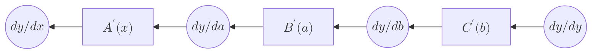
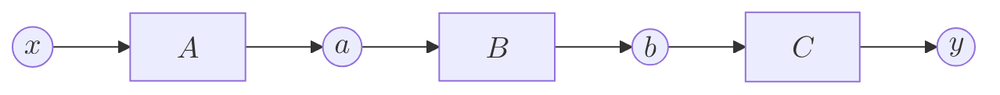

# 微分の理論
微分は機械学習の分野において重要なものです。私たちはこれから微分を使って機械学習の核心を実装していきます。それに先立ち、この章では微分の効率的な求め方について解説します。なお、ここでは合成関数の微分の知識を前提としています。

## チェーンルール
チェーンルールとは複数の関数が組み合わさった「合成関数」を微分する際に、それぞれの関数の微分を掛け合わせることで、合成関数の微分（導関数）を求められるというものです。  
式にすると

**$$\frac{dy}{dx}=\frac{dy}{dy} \cdot\frac{dy}{db} \cdot\frac{db}{da} \cdot\frac{da}{dx}$$**

となり、ｘに関するｙの微分は各関数の微分の積によって表わすことができます。つまり**合成関数の微分は各関数の局所的な微分へ分解できる**ということです。

## バックプロパゲーションの理論
**$$\frac{dy}{dx}=\frac{dy}{dy} \cdot\frac{dy}{db} \cdot\frac{db}{da} \cdot\frac{da}{dx}$$**  

の式を変形すると  

**$$\frac{dy}{dx} = \left(\left(\frac{dy}{dy}\cdot\frac{dy}{db}\right)\frac{db}{da}\right)\frac{da}{dx}$$**

この式は出力方向から入力方向へ微分を計算していくことを表しています。()で閉じたところはdy/dbになっています。  これは最初dy/dyだったのが、C’(b)のbackward（もしくは導関数）によってdy/dbを導くことができたということです。  

これを同様にB’(a)、A’(x)でも行うと、dy/dxが求まります。この計算をグラフによって表すと

グラフにすることで微分の流れがわかりやすく、このグラフを見るとｙの各変数に関する微分が伝播することでｘに関するｙの微分が求まっていることがわかります。これがバックプロパゲーションです。ここでの重要な点は伝播するデータはすべて「ｙに関する微分」ということです。  
なぜこのバックプロパゲーションが微分の効率的な求め方なのかというと機械学習は基本的に大量のパラメータを入力として「損失関数」を求めていくものです。つまり私たちは損失関数の各パラメータに関する微分を求める必要があります。そのような場合バックプロパゲーションを用いれば一回の伝播で全てのパラメータに関する微分を求められるのです。

ここで通常の計算と微分を求める計算の比較をしてみると

この２つの図を見てわかるように順伝播と逆伝播は対応していることがわかります。そしてC‘(b)に注目するとこの微分の計算をするにはｂという値が必要になります。
同様なことが各計算にもいえます。つまり逆伝播をするためには順伝播で求めたデータが必要であるということです。 
**この微分の計算を最初のxまでたどれば、yをxで微分したことになります。** そのためバックプロパゲーションを実装するには順伝播を行い、その各変数の値を保持しなければなりません。  

いろいろ長く話してきましたが、
大事なことは、 **変数と関数のつながりとデータをしっかり保持し、この流れの源流にたどれるようにすることです。** はじめはすんなり理解できないと思いますが、 **手で実装するにつれ、理解できるようになります。** 
詳しい説明は実際に実装する時に行います。では実際にバックプロパゲーションを実装していきましょう。

