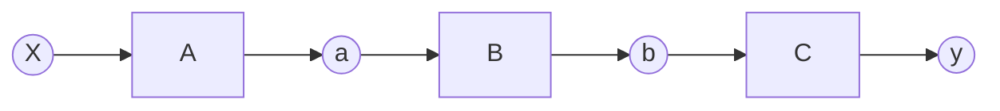
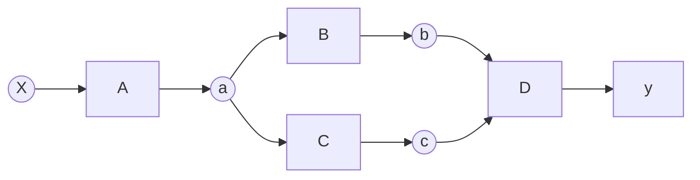

# 微分の理論（複雑な関数）
これまでわたしたちは下のグラフのような一直線に並ぶ計算グラフを扱ってきました。



しかし変数と関数の「つながり」はそのような一直線とは限りません。これまでの実装により私たちはadd関数のように２変数への拡張を行ってきました。それによってより複雑な「つながり」を作ることができました。しかし今のフレームワークでは複雑な「つながり」の逆伝播を正しくすることができません。
今のフレームワークにどのような問題があるのか調べるために１つのシンプルな計算グラフについて考えましょう。


この計算グラフで注目したい点は変数aです. 前の章で紹介したようにaの微分にはaの出力側から伝播する２つの微分が必要になります。その点を注力して正しい計算グラフの流れを一つ一つ表示してみます。（矢印は逆伝播を表しています。）   

---

```mermaid
graph RL
 y((y)) --> D[D]
 D --> b((b))
 D --> c((c))
 b --> B[B]
 c --> C[C]
 B --> a((a))
 C --> a
 a --> A[A]
 A --> X((X))
 ```

---

```mermaid
graph RL
 y((y)) --> D[D]
 D --> b((b))
 D --> c((c))
 b --> B[B]
 c --> C[C]
 B --> a((a))
 C --> a
 a --> A[A]
 A --> X((X))
 ```
