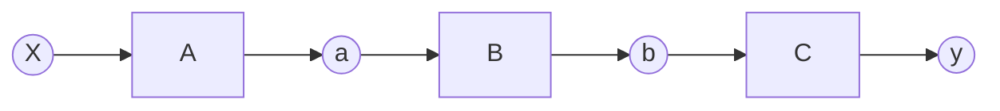
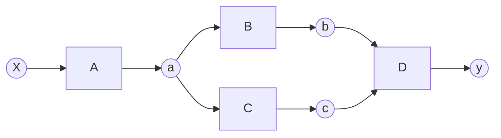

# 微分の理論（複雑な関数）
これまでわたしたちは下のグラフのような一直線に並ぶ計算グラフを扱ってきました。



しかし変数と関数の「つながり」はそのような一直線とは限りません。これまでの実装により私たちはadd関数のように２変数への拡張を行ってきました。それによってより複雑な「つながり」を作ることができました。しかし今のフレームワークでは複雑な「つながり」の逆伝播を正しくすることができません。
今のフレームワークにどのような問題があるのか調べるために１つのシンプルな計算グラフについて考えましょう。


この計算グラフで注目したい点は変数aです. 前の章で紹介したようにaの微分にはaの出力側から伝播する２つの微分が必要になります。その点を注力してまずはじめに正しい計算グラフの流れを一つ一つ表示してみます。（矢印は逆伝播を表しています。  
※ここではb,cへの逆伝播の順番は問題ではないので、そこの流れは省略しています。   

---
1   
```mermaid
graph RL
 y((y)) --> D[D]
 D --> b((b))
 D --> c((c))
 ```

---
2
```mermaid
graph RL
 y((y)) --> D[D]
 D --> b((b))
 D --> c((c))
 c --> C[C]
 C --> a((a))
 ```

 ---

3
```mermaid
graph RL
 y((y)) --> D[D]
 D --> b((b))
 D --> c((c))
 b --> B[B]
 c --> C[C]
 B --> a((a))
 C --> a
 
 ```

  ---

4
```mermaid
graph RL
 y((y)) --> D[D]
 D --> b((b))
 D --> c((c))
 b --> B[B]
 c --> C[C]
 B --> a((a))
 C --> a
 a --> A[A]
 A --> X((X))
 ```  
---
今示した順番で伝播していますが関数の目線からいうとD、B、C、Aの順番で逆伝播を行っています。ここでB,Cの順番はどちらでもかまわないのですが、大切なのは**関数B、Cの逆伝播を終わらせてから、関数Aの逆伝播をおこなう**ということです。   

では私たちのプログラムは実際にこのように正しく関数を取り出してくれるのでしょうか。下のコードで実行してみましょう。   
TODO: コード追加予定   

すると私たちの計算グラフは次の順番で処理します。

---
1   
```mermaid
graph RL
 y((y)) --> D[D]
 D --> b((b))
 D --> c((c))
 ```

---
2
```mermaid
graph RL
 y((y)) --> D[D]
 D --> b((b))
 D --> c((c))
 c --> C[C]
 C --> a((a))
 ```

 ---

3
```mermaid
graph RL
 y((y)) --> D[D]
 D --> b((b))
 D --> c((c))
 c --> C[C]
 C --> a((a))
 a --> A[A]
 A --> X((X))
 ```

  ---

4
```mermaid
graph RL
 y((y)) --> D[D]
 D --> b((b))
 D --> c((c))
 b --> B[B]
 c --> C[C]
 B --> a((a))
 C --> a
 a --> A[A]
 A --> X((X))
 ```

   ---

5
```mermaid
graph RL
 y((y)) --> D[D]
 D --> b((b))
 D --> c((c))
 b --> B[B]
 c --> C[C]
 B --> a((a))
 C --> a
 a --> A[A]
 a --> A
 A --> X((X))
 A --> X
 ```
---
ではここで、この処理がどのように行われるのか考えてみましょう。重要なのは、**Variable**のメソッドの**backward**の中の**funcs**です。逆伝播で遡るにあたって、一つ前の関数をこのリスト(正しくはベクタ)に入れ、そこから関数を取り出してbackwardを行い、その関数のinputのcreatorである関数を再び追加するという流れですが、このような多変数関数になると、リストの中には複数の関数が含まれる状態になります。なので、**いかに正しい順番で関数を取り出せるか**が重要となってきます。逆に言えば、今までの一変数関数の場合は、リストに常に関数は一つしかないので、取りだし方を考えなくてもよかったのです。

現状の設計ではこのように、本来B、Cの関数を先に呼び出した後、Aを呼び出すべきであるにもかかわらず、実際はCの後、先にAをとりだしてしまっています。さらにBを取り出した後、Bのinputであるaが認識されることで、再びAが取り出され、backwardするという処理を行ってしまいます。ではこの場合のfunsベクタの要素の挙動を先ほどの逆伝播の流れとともに考えてみましょう。
>vecの追加、取り出しは、どちらとも後ろから追加、取り出しです。

1. 最初にfuncsは初期化されるので、funcs = []　つまり空です。 

2. はじめにyのcreatorである関数Dが追加されます。funcs = [D]   
3. 次にDが取り出され、DのinputであるbのcreatorのBが追加されます。funcs = [B]
4. Dのもう一つのinputであるcのcreatorのCが追加されます。funcs = [B,C]
5. Cが取り出され、CのinputであるaのcreatorのAが追加されます。funcs = [B,A]
6. Aが取り出され、Aのinputであるxのcreatorはないので何も追加されません。funcs = [B]
7. Bが取り出され、BのinputであるaのcreatorのAが追加されます。funcs = [A]
8. Aが取り出され、Aのinputであるxのcreatorはないので何も追加されません。funcsは空になったので終了。funcs = []  

 
今までのbackwardメソッドでは計算グラフが直線的だったため、何も考えずに前の関数を呼んでいましたが、今後は適切な順番に関数を取り出すことが求められます。ではどのように正しい順番で取り出すのか。まずは**正しい順番とは何か**を考えて、そこから一般化してみましょう。  

先ほどの例に出した関数で考えてみましょう。正しい順番としては、D→(C→B)→Aでした。ここでCとBの間で括弧をしたのは、どちらの順番でも良いという意味を示すためです。ではなぜBとCは順番がどちらでもよいのでしょうか。それは、同じ変数をinputとしているからです。aに向かう微分、(ここでは∂b/∂a,∂c/∂aを指す)が求まってはじめて、変数aのVariableとしての微分gradが定まるからです。これが定まらないと、xの微分が求まりません。なぜならxの微分を求めるAのbackwardはaの微分を引数としているおり、aの微分に依存しているからです。つまり、**同じinputを持っている関数同士では、順位は同じであり、同じ順位の関数が全て呼び出されてはじめて次の関数につなげられる**ということです。このことから、**関数の取り出す優先順位は、inputの順番で決まる**と考えられます。   

次にinput、すなわち変数となるVariableの順番を考えましょう。これは源流であるxに近い方が優先順位が低いと言えます。なぜなら、源流の真反対である終端のyから源流にたどっていくからです。今回はx←a←(b←c)←yなので、優先順位は左に行くほど低く、右に行くほど高いです。**このVariableの優先順位は、変数が生まれた順番で定義することができます。** 例えばxが一番はじめに生まれるので1とし、次に生まれるaを2、その要領で数字を割り振っていけば、数字が高いほど優先順位が高いと定義できます。  

以上のことをまとめると、関数の優先順位はinputの順番で決まり、そして、そのinputの順番はそのVariableが生まれた順番で決まるということが分かりました。あとはVariableの生まれた順番をどう求めるかです。それは順伝播でつながりを構築している最中で求めることができます。ある関数fが変数xをinputとして受け取ったとき、xの優先順位を読み取り、outputとなる変数を生み出す際にその優先順位より1優先順位が高い値を持たせればいいのです。ではこれらの処理を実際にプログラムに取り込むために、改めて一から処理を考えてみましょう。   

まず優先順位の基準となる値を**世代**としましょう。この値は自然数です。はじめの変数(ここではx)には1を持たせます。この変数を関数に渡す際、関数の世代をinputの変数の世代と同じに設定します。そうすれば、関数の優先順位はinputの順番で決まるというルールを従うことができます。そして、関数がoutputを出力する際、その変数の世代の値を自身の世代に1足して持たせれば、新たな世代を生み出すことができます。言葉だけの説明ではイメージが湧かないので、世代というものがどのように与えられるか可視化します。  

---

 **forward**
 ```mermaid
graph LR
 subgraph 世代:1
 X((X)) --> A[A]
 end
 subgraph 世代:2
 A --> a((a))
 a --> B[B]
 a --> C[C]
 end
 subgraph 世代:3
 B --> b((b))
 C --> c((c))
 b --> D[D]
 c --> D
 end
 D --> y((y))
```
---
**backward**
```mermaid
graph RL
 y((y)) --> D[D]
 subgraph 世代:3
 D --> b((b))
 D --> c((c))
 end
 b --> B[B]
 c --> C[C]
 subgraph 世代:2
 B --> a((a))
 C --> a
 end
 subgraph 世代:1
 a --> A[A]
 A --> X((X))
 end
 ```
---
forwardの場合、例えばxが世代1と設定されているので、Aも世代1と設定されます。そして、Aのoutputであるaは世代が1に1足されて2となります。これを繰り返せば、グラフのような**世代の関係が生まれます。** その後逆伝播では、順伝播で作られた世代の関係の大きい順に関数を取り出せば、正しい順番で処理できます。先ほどの問題では、Cの後にBではなくAを取り出してしまいましたが、世代の順番に従えば、世代が1のAより、世代が2であるBが先に取り出されるようになります。   

ではこれらの理論をもとに、次の章で実際に実装していきましょう。  


