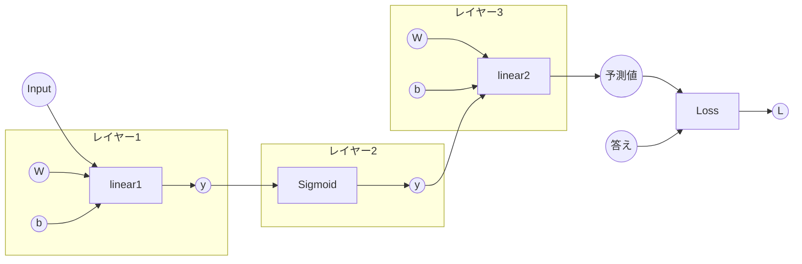

# Layerの実装
では先ほどの手動でニューラルネットワークの学習を一つずつ自動化していきます。最初は **Layer** についてです。Layerは主に二つの役割があります。一つ目はデータを計算、処理すること。二つ目はパラメーターを管理することです。

先のコードの関数である **Linear** を見てみます。するとこの関数は\\(w\\)と\\(b\\)の二つのパラメーターを使用します。そして、このパラメーターを外で一括で更新しています。(current_gradなどを使っているところです。)このLayerというものは簡単言えば、関数と関数に関するパラメーターを保持、管理させるためのものです。そうすれば、自分たちが行ってきたパラメーターの初期化や、更新をこのLayerに丸投げすることができます。ではそれを可能にする構造体を実装していきます。
```rust
pub fn linear_simple(x: &RcVariable, w: &RcVariable, b: &Option<RcVariable>) -> RcVariable {
    let t = matmul(&x, &w);

    let y;
    if let Some(b_rc) = b {
        y = t + b_rc.clone();
    } else {
        y = t;
    }
    y
}
```
## Layerトレイト
はじめに **Layerトレイト** を実装します。Layerと言っても様々種類があるので、それらにLayerとしての共通のふるまいを持たせます。考え方は **Functionトレイト** と同じです。トレイトをもとに、いくつかの構造体を実装していきます。

では **core.rs** ファイルと同じ階層に **layer.rs** ファイルを追加します。このファイルは **Functions** と同じように、Layerをまとめるためのファイルです。新たにファイルを追加したので、モジュールとして認識してもらうよう、 **lib.rs**、**mod.rs** に **layer.rs** の名前を追加しておきます。これに関しては[パッケージ化](./package.md)で説明してあります。

では **Layerトレイト** を **layer.rs** に追加します。

```rust
pub trait Layer: Debug {
    fn set_params(&mut self, param: &RcVariable);
    fn get_input(&self) -> RcVariable;
    fn get_output(&self) -> RcVariable;
    fn call(&mut self, input: &RcVariable) -> RcVariable;
    fn get_generation(&self) -> i32;
    fn get_id(&self) -> usize;
    fn params(&mut self) -> &mut FxHashMap<usize, RcVariable>;
    fn cleargrad(&mut self);
    fn has_params(&self) -> bool;
}
```
>今後、**Function構造体** と同じように、 **Layerトレイト** を継承した構造体を **Layer構造体** と呼ぶことにします。  

**get_input()**、**get_output()**、**call()**、**get_generation()**、**get_id()** に関しては **Function構造体** と同様です。ただし、callにおいてレイヤー構造体はinputもoutputも弱参照で保持します。これは単に関数も互いに参照しているため、複雑になってしまうからです。   
<br>    


基本的に、**Layer構造体** は **Function構造体** にパラメーターを管理させるよう拡張させたものなので、 **Functionトレイト** と近しいものとなります。このトレイトについては、次に実装する **Linear構造体** を参考にして理解していただきたいです。   
<br>   


**Layerトレイト** の大きな違いはパラメーターの扱いにあります。**set_params()**、**params()**、**cleargrad()**、**has_params()**　はパラメーターを管理するLayer特有の関数です。まず前提として、Layer構造体はフィールドとして **パラメーターの配列を保持しています。** この配列については **Linearレイヤー** で説明します。   
<br>  


- **set_params()**   
この関数はレイヤー構造体にパラメーターを持たせる関数です。引数として **RcVariable** を渡し、フィールドであるパラメーターの配列に追加します。この時、RcVariable(正確にはRc型の参照)とそのid二つを持たせます。idを持たせる理由は今後の拡張を踏まえ、より管理しやすくするためです。
<br>

- **params()**  
これは単にフィールドとして保持している配列を返す関数です。これは後の[Optimizer](./Optimizer.md)でOptimizer構造体にパラメーターを渡して更新してもらう際に使用します。
<br>

- **cleargrad()**   
これは各パラメーターの勾配、 **grad** の値を **None** にする関数です。保持するパラメーターをすべてイテレーターとして取り出し、Noneにします。
<br>

- **has_params()**   
これはレイヤー構造体がパラメーターを保持しているかを **bool型** で返す関数です。実はこの後、パラメーターを保持しないレイヤー構造体を実装します。(もしくは今後の拡張で保持しないレイヤーを実装する可能性があります。)なので、そのための設定です。Linearの場合はもちろん保持するのでtrueを返します。これは個別に変更します。


ではLinearレイヤーを踏まえて説明します。

## Linearレイヤー

下はLinearレイヤー構造体のコードです。まずはじめにパラメーターの配列について説明します。これはレイヤーがフィールドとして持つもので、フィールド名は基本的に **params** です。型は **FxHashMap** です。この型はいわゆる辞書型というもので、パラメーターの **RcVariable** とidをペアとして保存します。これは普通の **HashMap** とは異なりますが、それは、イテレーターとして返す際、HashMapはネットワークの安全性を保つためにあるアルゴリズムを処理して返すのに対し、FxHashMapはただ単に順番通りに返すため、処理が少し速いとされています。今回はパラメーターをただ返す単純な処理で十分なので、こちらの型を用意します。外部クレートなので、各自依存関係を追加してください。  

>FxHashMapの仕様はHashMapとほぼ同じです。詳しくは[FxHashMap](https://zenn.dev/arome/articles/f9c52bf1c2a246)をご覧ください。こちらはリポジトリの参考文献に載せているものです。


では **Linearレイヤー** をもとにレイヤーの計算処理について説明していきます。これに関しては説明が長くなるので、分割して説明していきます。

レイヤー構造体はFunction構造体に対して、パラメーターの初期化、管理という重要な機能があります。まずはパラメーターの初期化についてです。コンストラクタとして構造体を作成し、値を流すという処理の中に、自動でパラメーターの作成し、保持するという処理を加えます。ではパラメーターの初期化の方法を改めて考えます。

[手動による学習](./NN_syudou_jissou/syudou_training.md)のところで最初にパラメーターを作成しました。これをもとに考えていくわけですが、行列を作成するにあたって重要なことは形状です。コードを見るとI,H,Oと私たちが形状のデータを与えていますが、今回は自動で行うため、引数として形状の値を渡します。そして行列をnew()またはforward()中で作成します。パラメーターは正規分布に従ってランダムな値にするため、**standardNormal** といったオプションを用います。**((1.0f32 / i_f32).sqrt())** はスケールを合わせる計算です。 

また行列計算をするにあたり、列数と行数が一致しているという条件があるので、それを用いれば、ユーザーが行数を渡さなくても、自動で行列を作成することができます。これがforward()のなかで処理させることです。

そして最後にforward()で関数の計算を行います。この処理は普通のFunction構造体の処理です。

TODO: パラメーターのスケール設定   
TODO: 説明増やす。特に行列の初期化、forward
```rust
pub struct Linear {
    input: Option<Weak<RefCell<Variable>>>,
    output: Option<Weak<RefCell<Variable>>>,
    out_size: u32,
    w_id: Option<usize>,
    b_id: Option<usize>,
    params: FxHashMap<usize, RcVariable>,
    generation: i32,
    id: usize,
}

impl Layer for Linear {
    fn set_params(&mut self, param: &RcVariable) {
        self.params.insert(param.id(), param.clone());
    }
    fn get_input(&self) -> RcVariable {
        let input = self
            .input
            .as_ref()
            .unwrap()
            .upgrade()
            .as_ref()
            .unwrap()
            .clone();
        RcVariable(input)
    }

    fn get_output(&self) -> RcVariable {
        let output;
        output = self
            .output
            .as_ref()
            .unwrap()
            .upgrade()
            .as_ref()
            .unwrap()
            .clone();

        RcVariable(output)
    }

    fn call(&mut self, input: &RcVariable) -> RcVariable {
        let output = self.forward(input);
        self.input = Some(input.downgrade());
        self.output = Some(output.downgrade());

        output
    }

    fn get_generation(&self) -> i32 {
        self.generation
    }
    fn get_id(&self) -> usize {
        self.id
    }
    fn params(&mut self) -> &mut FxHashMap<usize, RcVariable> {
        &mut self.params
    }

    fn cleargrad(&mut self) {
        for (_id, param) in self.params.iter_mut() {
            param.cleargrad();
        }
    }

    fn has_params(&self) -> bool {
        true
    }
}

impl Linear {
    fn forward(&mut self, x: &RcVariable) -> RcVariable {
        if let None = &self.w_id {
            let i = x.data().shape()[1];
            let o = self.out_size as usize;
            let i_f32 = i as f32;

            let w_data: ArrayBase<OwnedRepr<f32>, Dim<[usize; 2]>> =
                &Array::random((i, o), StandardNormal) * ((1.0f32 / i_f32).sqrt());

            let w = w_data.rv();

            self.w_id = Some(w.id());
            self.set_params(&w.clone());
        }

        // フィールドでパラメータのidを保持しているので、idでパラメータを呼び出す
        let w_id = self.w_id.unwrap();
        let w = self.params.get(&w_id).unwrap();

        //bはoption型なので、場合分け
        let b;
        if let Some(b_id_data) = self.b_id {
            b = self.params.get(&b_id_data).cloned();
        } else {
            b = None;
        }

        let y = linear_simple(&x, &w, &b);

        y
    }

    pub fn new(out_size: u32, biased: bool, opt_in_size: Option<u32>) -> Self {
        let mut linear = Self {
            input: None,
            output: None,
            out_size: out_size,
            w_id: None,
            b_id: None,
            params: FxHashMap::default(),
            generation: 0,
            id: id_generator(),
        };

        //in_sizeが設定されていたら、ここでWを作成
        //されていない場合は後で作成
        if let Some(in_size) = opt_in_size {
            let i = in_size as usize;
            let o = out_size as usize;

            let i_f32 = in_size as f32;

            let w_data: ArrayBase<OwnedRepr<f32>, Dim<[usize; 2]>> =
                &Array::random((i, o), StandardNormal) * ((1.0f32 / i_f32).sqrt());

            let w = w_data.rv();

            linear.w_id = Some(w.id());
            linear.set_params(&w.clone());
        }

        if biased == true {
            let b = Array::zeros(out_size as usize).rv();
            linear.b_id = Some(b.id());
            linear.set_params(&b.clone());
        }

        linear
    }
}
```

レイヤー構造体が行うのは実質パラメーターの初期化し、保持しながらFunction構造体に渡すことだけです。グラフのように **レイヤーは関数をあくまで包むイメージ** です。なので順伝播、バックプロパゲーションといった計算はFunction構造体の関数に任せる構造となっています。



Layer構造体も **Function構造体** のように今後様々なレイヤーを実装していきます。その際は、このLinear構造体を参考にして実装してください。例えばLinearに活性化関数をセットした **Denseレイヤー**、活性化関数のみを扱う **activationレイヤー** などです。これらのレイヤーの実装に関しては補足のところで説明したいと思います。

TODO: 補足説明追加