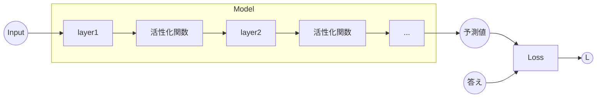

# Modelの実装
続いて **Model** の実装です。前のLayerがパラメーターを管理するなら、このModelはレイヤーを管理するものです。このModelも同様に、**Modelトレイト** を実装し、様々な構造体に継承させるので、Modelトレイトを実装した構造体を**Model構造体** と呼ぶことにします。

```rust
pub trait Model {
    fn stack(&mut self, layer: impl Layer + 'static);
    fn forward(&mut self, x: &RcVariable) -> RcVariable;
    fn layers(&self) -> Rc<RefCell<Vec<Box<dyn Layer + 'static>>>>;
    fn layers_mut(&mut self) -> Rc<RefCell<Vec<Box<dyn Layer + 'static>>>>;
    fn cleargrad(&mut self);
}
```

Modelトレイトを実装しましたが、考え方は先ほどのLayerと似ています。先ほどと同じように基本となるModel構造体の **BaseModel** を交えて説明します。



---

ModelがフィールドとしてLayerの配列を保持します。これは先ほどのLayerがパラメーターを配列で保持するのと同じことです。この際、フィールドの配列にLayerを追加する処理を **stack()** としています。そのように設定すれば、下のコードのようにmodelにレイヤーを持たせることができます。次に **forward()** で保持しているLayerたちをイテレーターで取り出し、データを順に流していきます。最後に **cleargrad()** でLayerを取り出し、Layerが保持するパラメーターの微分を初期化することで、すべてのパラメーターに関して微分を初期化できます。ModelとしてLayerを扱うことで、手動によるパラメーターの管理をすべてModelに任せることができました。

```rust
let mut model = BaseModel::new();
model.stack(L::Linear::new(10, true, None));
```

また、私たちはニューラルネットワークの層をブロックと見立て、それをモデルに積んでいくイメージを持てるような設計にしました。 **model.stack()** によってLayerというブロックを一つずつ積んでいく感覚を、今後より大規模なニューラルネットワークを構築する際に感じることができると思います。

```rust
pub struct BaseModel {
    input: Option<Weak<RefCell<Variable>>>,
    output: Option<Weak<RefCell<Variable>>>,
    layers: Rc<RefCell<Vec<Box<dyn Layer + 'static>>>>,
}

impl Model for BaseModel {
    fn stack(&mut self, layer: impl Layer + 'static) {
        let add_layer = Box::new(layer);
        self.layers.borrow_mut().push(add_layer);
    }

    fn cleargrad(&mut self) {
        for layer in self.layers.borrow_mut().iter_mut() {
            layer.cleargrad();
        }
    }
    fn layers(&self) -> Rc<RefCell<Vec<Box<dyn Layer + 'static>>>> {
        self.layers.clone()
    }

    fn layers_mut(&mut self) -> Rc<RefCell<Vec<Box<dyn Layer + 'static>>>> {
        self.layers.clone()
    }

    fn forward(&mut self, x: &RcVariable) -> RcVariable {
        let mut y = x.clone();

        for layer in self.layers.borrow_mut().iter_mut() {
            let t = y;
            y = layer.call(&t);
        }

        y
    }
}

//loss: Loss, optimizer: Optimizer, learning_rate: f32

impl BaseModel {
    pub fn new() -> Self {
        BaseModel {
            input: None,
            output: None,
            layers: Rc::new(RefCell::new(Vec::new())),
        }
    }

    pub fn call(&mut self, input: &RcVariable) -> RcVariable {
        // inputのvariableからdataを取り出す

        let output = self.forward(input);

        //　inputsを覚える
        self.input = Some(input.downgrade());

        //  outputを弱参照(downgrade)で覚える
        self.output = Some(output.downgrade());

        output
    }
}
```

Model構造体も **Function構造体** のように今後様々なレイヤーを実装していきます。また複雑で独自なレイヤーを自動で初期化し、保持するといったオリジナルのモデル構造体も実装することができます。ぜひこの **BaseModel** を参考にして実装してみてください。