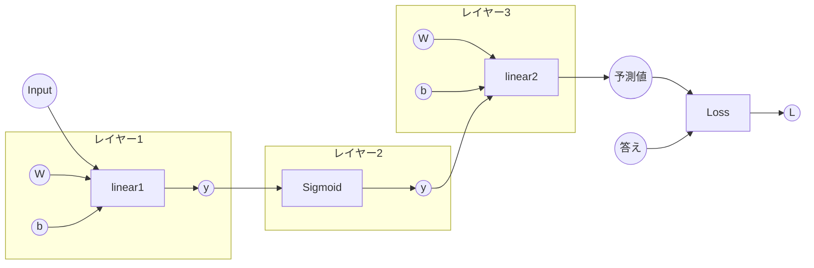

# 誤差逆伝播法
最後に誤差逆伝播法についてです。ニューラルネットワークは誤差逆伝播法を用いて自動で重みを調整するのですが、今までバックプロパゲーションを実装してい来たのはまさにこの誤差逆伝播法を実現するためのものです。  

ニューラルネットワークの学習とはいわば関数の最適化です。その時の関数はモデルの出力、すなわちそのモデルの予測値と答えとなる教師データの **誤差を求める関数** です。  

誤差が小さいモデルを目指すわけですからその関数の値が小さくなるよう重みである **パラメーター** を調節します。ではどのようにパラメーターを調整するのでしょうか。ここで、変数の微分値を用います。  

## パラメーターの更新
私たちが今まで実装してきた変数である **RcVariable** は **grad** としてその変数の微分の値を保持しています。最終的な変数は誤差を示す値なので **L** とすると、あるパラメーター **W** の **grad** は\\(\frac{\partial L}{\partial W}\\) となります。これは **L** を**W** の関数と見立てたときの勾配と言えます。この勾配を用いれば、**L** を最小化する**W** を求めることできます。そして、その値に近づくように更新するのをすべてのパラメーターで行うことが、深層学習の学習です。この最適化するアルゴリズムは最適化関数によるものであり、いくつか種類がありますが、単に勾配の値の負の方、つまり逆の方に値を近づけていくことで誤差を最小にしていくアルゴリズムを **勾配降下法** と言います。今回はこの一番基本的でシンプルな勾配降下法を使用してみます。勾配降下法のパラメーター更新の方法を数式にすると、$$W \xleftarrow{} W - \alpha\cdot \frac{\partial L}{\partial W}$$となります。\\(\alpha\\)は学習を表しています。 数式で表すと少し難しく感じますが、プログラムで書くと、

```rust
let current_grad_w = W.grad().unwrap().data();
W.0.borrow_mut().data = w_data - lr * current_grad_w;    
```
と理解しやすくなると思います。

この最適化関数についてはその後の[Optimizer](../Optimizer.md) のところで再び触れます。

---

ニューラルネットワークのイメージ
loss変数からバックプロパゲーションを行うことで、すべての変数の勾配が求まる。それを用いてパラメーターを更新していく。


## 誤差を求める関数
続いて先ほど触れた誤差を求める関数です。前に説明した学習時のモデルの予測値と、答えとなる教師データの正解ラベルの誤差を求める関数を **損失関数** と言います。誤差を求めると言いますが、予測値と正解ラベルがどれくらい違うかを評価する誤差を導き出す方法は様々あります。ここでは代表的な関数である **二乗平均誤差** について説明します。   
この関数の処理は名前の通り、モデルの予測値と答えの差を2乗し、足し合わせて平均を取るというものです。\\(N\\)はバッチ数、つまりデータ数を表します。予測値と答えの差が大きいと、\\(L\\) は大きく、逆に差が小さくなるほど\\(L\\)は小さくなります。

$$L = \frac{1}{N}\sum_{i=1}^N (y_i-t_i)^2$$

ではこの関数を実装してみます。

```rust
fn mean_squared_error(x0:&RcVariable,x1:&RcVariable) ->RcVariable{
    let diff =x0.clone()-x1.clone();
    let len = diff.len() as f32;
    println!("len = {:?}",len);
    
    let error = sum(&diff.pow(2.0), None) /len.rv();
    
    error
}
```
**len** はデータ数の\\(N\\) を表しています。ここで予測値と正解ラベルの行列は同じ形状であるため(答えはスカラーなのに、予測値が行列だというように、答えと形式が異なるなら、もともとニューラルネットワークの構造が正しくありません。)

$$
Y:\begin{pmatrix}
y_0 \\\\ 
y_1 \\\\ 
y_2\\\\
\vdots\\\\
y_n
\end{pmatrix} -
T:\begin{pmatrix}
t_0 \\\\ 
t_1 \\\\ 
t_2\\\\
\vdots\\\\
t_n
\end{pmatrix} =
diff:\begin{pmatrix}
y_0 - t_0 \\\\ 
y_1 - t_1 \\\\ 
y_2 - t_2\\\\
\vdots\\\\
y_n - t_n
\end{pmatrix} 
$$


$$
diff:\begin{pmatrix}
y_0 - t_0 \\\\ 
y_1 - t_1 \\\\ 
y_2 - t_2\\\\
\vdots\\\\
y_n - t_n
\end{pmatrix} 
\xrightarrow{\text{Square}}
\begin{pmatrix}
(y_0 - t_0)^2 \\\\ 
(y_1 - t_1)^2 \\\\ 
(y_2 - t_2)^2\\\\
\vdots\\\\
(y_n - t_n)^2
\end{pmatrix}
\xrightarrow{\text{Sum}}
error:\begin{pmatrix}
L
\end{pmatrix}
$$
このように今までの行列の関数を用いて**二乗平均誤差** を求めることができます。

以上でニューラルネットワークを構築する最低限の材料がそろいました。では次のページでニューラルネットワークを構築します。