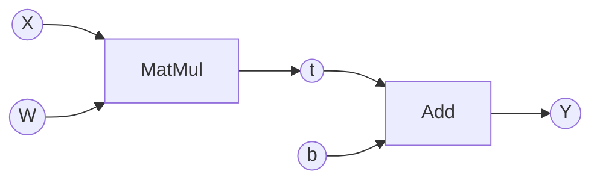

# Linear関数
では線型変換を行うLinear関数を実装します。線型変換は前に確認した通り、行列積を用いた\\(Y = X \cdot W + b\\)という式になります。正確には線型変換は\\(Y = X \cdot W \\)の行列積のみを指し、バイアスの\\(b\\)を加えると非線型変換になってしまいますが、深層学習の分野ではこの式を線型変換と捉えるのが一般的です。またこのような式は深層学習のフレームワークにおける全結合層の処理を指します。

この式をグラフにするとこのようになります。


バイアスのbは省略されることもあります。
私たちはこれらの関数(**Matmul,Add**)を実装してきたので、この式のバックプロパゲーションを自動で行うことができます。ではこの式を関数として定義します。

```rust
pub fn linear_simple(x: &RcVariable, w: &RcVariable, b: &Option<RcVariable>) -> RcVariable {
    let t = matmul(&x, &w);

    let y;
    if let Some(b_rc) = b {
        y = t + b_rc.clone();
    } else {
        y = t;
    }

    y
}
```
先ほどの式をそのままにして実装しました。このようにシンプルで可読性の高いコードを書くことができるのは、私たちが今までの間、つながりを作り、バックプロパゲーションを行う構造を自動化し、それをオーバーロードしたことによるものです。このコードは、xとwの行列積をとってtを出力し、バイアスはオプション的な存在なので、必要か必要でないかで場合分けします。使用しない場合、tをそのまま流します。

今後私たちは主に2種類の関数を実装していきますが、役割が全く異なり、混同してしまうと危険なのでここで整理しておきます。   

今私たちが作成した関数は処理をまとめたものです。つまり、Linearの処理を行うために、**Matmul**や**Add** といったFunction構造体の関数を呼び出すようにまとめたものです。もっと分かりやすく言うならば、このlinear_simple関数はただFunction構造体順序正しく呼び出しているだけであり、実際の計算をしているのは今まで実装してきたFunction構造体ということです。このただ呼び出す関数とFunction構造体の関数の違いを理解しておくことは、今後のニューラルネットワークの構築において重要になってきます。これは今後の**Layer**の実装のところで理解できるので、心配せず進んでください。