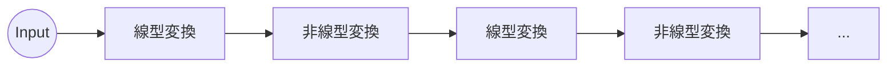

# 手動によるニューラルネットワークの構築
ではいよいよ今まで造ってきた関数を組み合わせてニューラルネットワークを構築していきます。  

私たちはニューラルネットワークを自動で構築するフレームワークを実装していくわけですが、最初は手動で組み立て、どのように自動化していくか考えていきます。  

はじめにニューラルネットワークの構造を簡単に説明します。深層学習の基本的な原理は**全結合層** による**線型変換**、**活性化関数** による**非線型変換** を互いにパイのように重ね、データを線型変換→非線型変換→線型変換→非線型変換の順番で次々と変換する処理です。

この二つの種類の変換を深い層にし、多く用いることで多様な表現を行う、すなわち複雑な問題にも対応できるようになります。この深い層を**深層学習**(*DeepLearning*)と言います。  
   

なぜこの2種類の変換を用いるかというと、それは線型、非線型の2種類のデータに対応できるようになるからです。例えば直線 \\(y = ax\\) は線型のデータです。一方、 \\(y = sinx\\) は非線型のデータです。このように多様なデータに対応するために、線型、非線型を組み合わせるのです。

では次に線型変換、非線型変換について説明します。

線型変換は以前に実装した**行列の積** を基本とする処理です。**MatMul** の説明の際にも触れましたが、inputのデータの\\(X\\)と重みの\\(W\\) を行列積でとることで、ニューラルネットワークの全結合層を表すことができます。この時の数式は \\(Y = X \cdot W + b\\) となります。この\\(b\\) はバイアスと言います。これは先ほどの直線の式 \\(y = ax+b\\)と似ています。スカラー版の直線の式を行列に拡張したというイメージです。一方非線型変換はシグモイド関数や\\(tanhx\\) などといった活性化関数に使われます。

>機械学習の分野における線型性と非線型性の違いはよく、直線となめらかな曲線で説明されます。線型性のみの場合は、分類において直線による線引きしかできませんが、非線型性を持つと、その線を曲線として表現でき、より複雑な分類を行えるようになります。

次に誤差逆伝播法を実装しますが、説明は後の**誤差逆伝播法**　のページで行います。

ではこれらの線型変換、非線型変換、そして誤差逆伝播法のための関数を簡易的に実装し、手動でニューラルネットワークを構築していきます。

