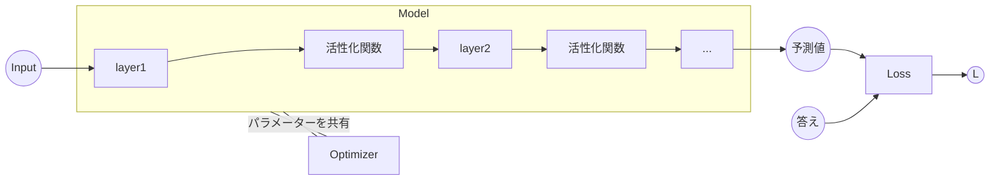

# Optimizerの実装
では最後に **Optimizer** のです。Optimizerはパラメーターの更新を扱う構造体です。[誤差逆伝播法](./NN_syudou_jissou/gosa_gyakudenpan.md)のところでも触れましたが、パラメーターを更新する最適化関数の種類は様々あり、それを選択できるように様々な最適化を行う構造体を用意する必要があります。なので、こちらも今までと同様に、 **Optimizerトレイト** を実装し、このトレイトを実装した構造体を **Optimizer構造体** と呼ぶことにします。  


<br>

先ほどと同じように **core.rs** ファイルと同じ階層に **optimizer.rs** ファイルを追加します。モジュールとして認識してもらうよう、 **lib.rs**、**mod.rs** に **optimizer.rs** の名前を追加しておきます。


```rust
pub trait Optimizer {
    fn setup(&mut self, target_model: &impl Model);
    fn update(&self);
    fn update_param(&self, param: &RcVariable) -> ArrayD<f32>;
}
```


---





---

Opimizerの基本的な構造は **Model構造体** からパラメーター(正確に言えば可変な参照)を受け取り、パラメーターをその構造体の最適化手法で更新します。

ではトレイトの関数について説明します。 
- **setup()**   
Model構造体の参照を渡すことで、Modelの保持するパラメーター(正確にはLayerを保持し、間接的にパラメーターにアクセスする)を共有することができます。

- **update()**   
Modelと共有したパラメーターを更新する関数です。**Function構造体** でいうと **call()** と同じ立ち位置です。  

- **update_param()**   
パラメーターのデータを実際に更新する関数です。**Function構造体** でいうと **forward()** と同じ立ち位置です。  


ではいままで説明してきた **勾配降下法** に近い最適化手法である **SGD** を例にして実装します。


```rust
pub struct SGD {
    lr: f32,
    layers: Option<Rc<RefCell<Vec<Box<dyn Layer + 'static>>>>>,
}

impl Optimizer for SGD {
    fn setup(&mut self, target_model: &impl Model) {
        self.layers = Some(target_model.layers().clone());
    }

    fn update(&self) {
        for layer in self
            .layers
            .as_ref()
            .expect("SGDにModelが設定されていません")
            .borrow_mut()
            .iter_mut()
            .filter(|layer| layer.has_params())
        {
            for (_id, param) in layer.params() {
                let new_param = self.update_param(&param);
                param.0.borrow_mut().data = new_param;
            }
        }
    }
    fn update_param(&self, param: &RcVariable) -> ArrayD<f32> {
        let current_param_data = param.data();
        let param_grad = param
            .grad()
            .as_ref()
            .expect("SGDで更新中のパラメータにgradがありません")
            .data();

        let new_param_data = current_param_data - self.lr * param_grad;
        new_param_data
    }
}

impl SGD {
    pub fn new(lr: f32) -> Self {
        Self {
            lr: lr,
            layers: None,
        }
    }
}
```

**setup()** で対象のModelを渡しながら、ModelのLayerを配列で保持します。**update()** と **update_param()** は **Function構造体** の **call()** と **forward()** に対応していると考えると理解しやすいと思います。

>今回はOptimizer構造体とModel構造体を分離させて、パラメーターを共有する設計となっています。この設計は役割がはっきり分離しているため、理解しやすい構造となっていますが、Layerをコピーしたりと、最適な設計とは言えません。例えば、Model構造体がOptimizer構造体をフィールドとして保持すれば、Model構造体の中で完結し、よりシンプルになります。


ここではSGD法を実装しましたが、他にも最適化関数は存在します。代表的なものは

- Momentum
- NAG
- Adagrad
- Adadelta
- Rmsprop  


など数多くあります。最適化の方法を調べ、SGDと同じように実装してみてください。そうすれば、フレームワークで用いることができます。

実際に使用するイメージはこうです。

```rust
let mut model = BaseModel::new();
model.stack(Dense::new(1000, true, None, Activation::Relu));
model.stack(Linear::new(10, true, None));

let mut optimizer = SGD::new(lr); //optimizer構造体の初期化
optimizer.setup(&model);          // modelの参照を保持
.
.

    model.cleargrad();      // パラメーターの勾配を初期化
    loss.backward(false);   // バックプロパゲーションを行い、パラメーターは微分を保持
    optimizer.update();     //パラメーターの微分をもとに更新
```

ではいよいよ今までの構造体を組み合わせ、自動化されたニューラルネットワークを構築しましょう。