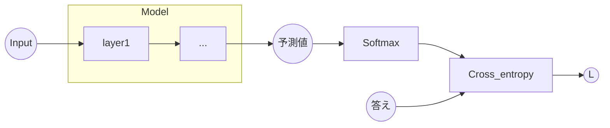

# 損失関数
私たちは実装した損失関数は **二乗誤差関数** は主に回帰に適した関数であり、このように損失関数は様々な種類があり、それぞれある学習に特化した関数です。続いて私たちは分類に特化した損失関数である **クロスエントロピー誤差** 、並びにそれとよくセットで用いられる **softmax関数** も実装していきます。

>クロスエントロピー誤差とsoftmax関数は多値分類を行うモデルで一般的にセットで使用されます。なので、既存のフレームワークの中ではクロスエントロピー誤差とsoftmaxを一つにまとめているものもあります。

クロスエントロピー誤差とはどのような損失関数なのでしょうか。

先ほどの説明のようにはじめにModelが求めた予測値をSoftmax関数に通した値を **Cross_entropy** に流すことで分類を行うことができるという仕組みです。ここで **softmax**　は予測値を確率に変換する役割があります。次に **Cross_entropy** を処理を表します。

$${L = -\sum_{j} t_j\cdot\log p_j}$$

 

\\(t_j\\)は正解ラベルを表しますが、今回実装する **Cross_entropy** は正解ラベルを **one_hotベクトル** で渡す設計にしますです。これにより、処理が簡潔になります。 **one_hotベクトル** とはこのような行列データです。例えばあるデータを0～2の3つに分類するとします。この時、クラス数は3なので **one_hotベクトル** の行列の列数は3です。左の正解ラベルの値のインデックスを1にし、他の値が全て0にすることで、かけることにより、正解ラベルの時の情報だけを維持し、他のデータは捨てることができます。またモデルの出力はクラス数の長さの行列をバッチ数の数分の行列を返すので、この **one_hotベクトル** の行列と形状が一致します。

 

$$
T:\begin{pmatrix}
0 \\\\ 
1 \\\\ 
2\\\\
1\\\\
2\\\\
0\\\\
\vdots\\\\
\end{pmatrix} 
\xrightarrow{\text{one-hot-vector}}
T':\begin{pmatrix}
1 & 0 & 0 \\\\ 
0 & 1 & 0 \\\\ 
0 & 0 & 1 \\\\
0 & 1 & 0 \\\\
0 & 0 & 1 \\\\
1 & 0 & 0 \\\\
\vdots & \vdots & \vdots \\\\
\end{pmatrix}
$$

 

$$
Y:\begin{pmatrix}
y_0 & y_1 & y_2\\\\
y_3 & y_4 & y_5
\end{pmatrix}
\xrightarrow{\text{Softmax}}
P:\begin{pmatrix}
p_0 & p_1 & p_2\\\\
p_3 & p_5 & p_6
\end{pmatrix}
\xrightarrow{\text{Log}}
P_{log}:\begin{pmatrix}
\log p_0 & \log p_1 & \log p_2\\\\
\log p_3 & \log p_4 & \log p_5
\end{pmatrix}
$$

 

$$
-P_{log}:\begin{pmatrix}
-\log p_0 & -\log p_1 & -\log p_2\\\\
-\log p_3 & -\log p_4 & -\log p_5
\end{pmatrix}
\cdot
T':\begin{pmatrix}
t_0 & t_1 & t_2\\\\
t_3 & t_4 & t_5
\end{pmatrix}
\xrightarrow{\text{}}
-P_{log}:\begin{pmatrix}
-t_0\cdot\log p_0 & -t_1\cdot\log p_1 & -t_2\cdot\log p_2\\\\
-t_3\cdot\log p_3 & -t_4\cdot\log p_4 & -t_5\cdot\log p_5
\end{pmatrix}
$$

 

先ほどの数式、

$${L = -\sum_{j} t_j\cdot\log p_j}$$
 
を改めて考えてみます。\\(t_j\\)は**one_hotベクトル** の行列の要素なので、値は0か1です。つまり、掛け算をすることで、この\\(t_j\\)が1の時、すなわち正しく予測できた場合のみ加算されます。誤差を表す\\(L\\) は正解したときのデータのみを足し合わせた値をマイナスにするので、正解が多いほどこの値自体は小さくなります。これによって誤差を表しているのです。

でははじめにクロスエントロピー誤差を実装するにあたって先に **softmax関数**、**Log関数**を実装していきます。

