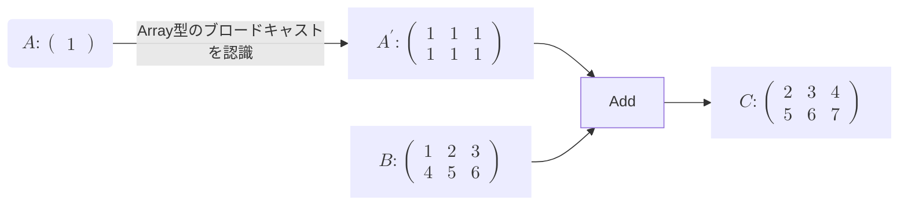
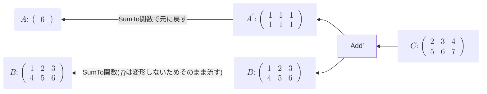

# ブロードキャストの四則演算対応
ブロードキャストによる形状の変換をFunctionトレイトの関数として実装することで、この変形を正しく逆伝播することができるようになりました。ではこのブロードキャストの関数を実際に組み込んでいきます。  

このブロードキャストははじめに説明した通り、行列の四則演算を簡単に行うためのものでした。つまり、このブロードキャストという機能は四則演算、すなわち**Add,Mul,Sub,Div** らの関数を呼び出す際に生じる機能です。なので、この関数の中でブロードキャストが起きるかどうかを調べ、もし起きる場合は私たちが先ほど実装した**BroadcastTo** 関数を用いてブロードキャストを行えば、形状変換が正しく認識されるのです。

ここでは**Add,Mul** 関数を例に挙げてどう組み込むのか説明します。

--
**Forward**



---

**Backward**    

TODO:数値ではなく、記号に変更する予定



※ここで重要なのはブロードキャストで変形させた形状をどう戻すかであり、数値は関係ありません。

---

順伝播の方は**Array型** のブロードキャスト機能で自動で変形させます。重要なのは、逆伝播の際、inputの形状と微分して出力した行列の形状が異なっているかどうか調べることです。ここでの場合、$A$と$A'$、また$B$ともう一つの$B$の形状が違うかどうかです。もし異なるなら、順伝播の際にブロードキャストが起きたと認識することができます。そしてここで **SumTo**関数に元のinputの形状を渡し、通すことでブロードキャストでの拡張を元に戻すことができます。**SumTo** には形状が同じ場合はそのまま流すようになっているので、$B$の場合はそのまま流します。   

**Add関数** の変更点
```rust
impl Function for AddF {

    fn backward(&self, gy: &RcVariable) -> Vec<RcVariable> {
        let mut gx0 = gy.clone();
        let mut gx1 = gy.clone();

        let x0 = &self.inputs[0];
        let x1 = &self.inputs[1];

        let x0_shape = IxDyn(x0.data().shape()); // <- inputの形状を取得
        let x1_shape = IxDyn(x1.data().shape()); // <- 

        if x0_shape != x1_shape {
            gx0 = sum_to(&gx0, x0_shape); // <- SumTo関数に通す。
            gx1 = sum_to(&gx1, x1_shape); // 形状が同じならそのまま流す。
        }

        let gxs = vec![gx0, gx1];

        gxs
    }
}
```

**Mul関数** の変更点
```rust
impl Function for MulF {

    fn backward(&self, gy: &RcVariable) -> Vec<RcVariable> {
        let x0 = &self.inputs[0];
        let x1 = &self.inputs[1];

        let mut gx0 = x1.clone() * gy.clone();
        let mut gx1 = x0.clone() * gy.clone();

        let x0_shape = IxDyn(x0.data().shape());
        let x1_shape = IxDyn(x1.data().shape());

        if x0_shape != x1_shape {
            gx0 = sum_to(&gx0, x0_shape);
            gx1 = sum_to(&gx1, x1_shape);
        }

        let gxs = vec![gx0, gx1];
        gxs
    }
}
```

関数の変更は**backward()** メソッドの中で **sum_to()** の処理を追加することです。ただし、**Mul** の場合は**Add** とは異なり、微分の値を計算するので、**$gx_0,gx_1$** を計算してから**sum_to** に通します。

ではこのように他の四則演算の関数も変更します。


ではブロードキャストに対応した**Add** 関数をテストしてみましょう。

```rust
#[test]
    fn add_with_broadcast_test() {
        use crate::core_new::ArrayDToRcVariable;

        let a = array![1.0, 1.0, 1.0, 1.0, 1.0].rv();

        let b = array![2.0].rv();

        let mut c = a.clone() + b.clone();

        println!("c = {}", c.data()); // [3,3,3,3,3]

        c.backward(false);

        println!("a_grad = {:?}", a.grad().unwrap().data()); // [1.0,1.0,1.0,1.0,1.0]
        println!("b_grad = {:?}", b.grad().unwrap().data()); // [5.0]
    }
```