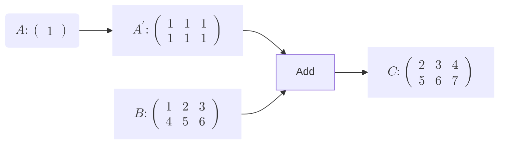
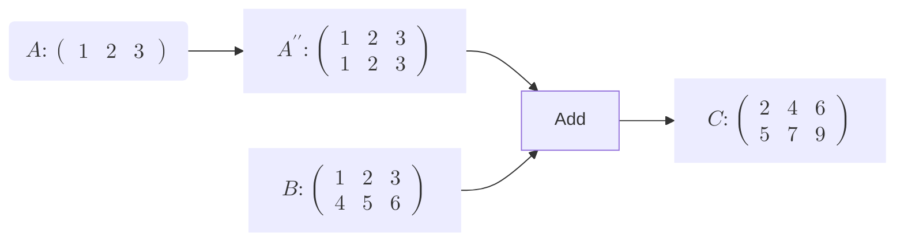
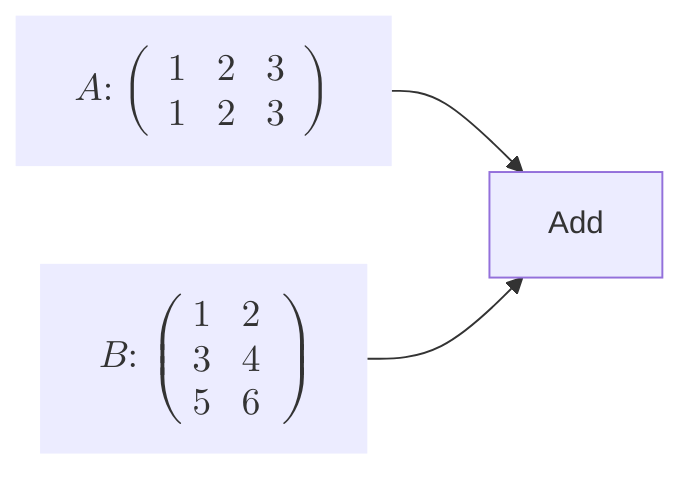
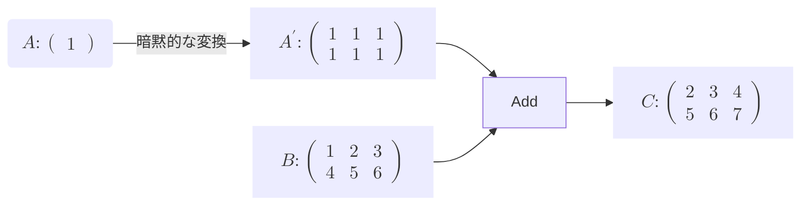

# ブロードキャスト対応
行列計算においてブロードキャストという機能があります。これは簡単に言えば、行列の演算が行われるよう、自動で計上を変形させる機能です。   
ここでブロードキャストの例を見てみます。

---
①

---

この行列計算を考えます。以前の説明により、要素ごとの計算は同じ形状である必要がありました。なので、この行列の四則演算も同じように、**A** と **B** は同じ形状でなければなりません。しかし、四則演算は多用するためユーザービリティの観点から
自動で形状を揃えることで、異なる形状の演算を可能にします。そして、この形状を揃える機能は**Array型** に装備されており、暗黙的に変換されます。上の計算の場合、AをBに揃えるような形で自動でA'に拡張することで、足し算を実現します。    

次の例も見てみましょう。   

---

②

---

この場合、Aは下にデータを拡張することでBと形状を揃えます。この拡張は上下左右にデータをコピーすることで拡張します。　　
ではこの場合はどうでしょうか。

---

③

---

この場合、AまたはBをブロードキャストすることはできません。もちろん列数の2,3の最小公倍数を考えれば、AとBが同じような形状に拡張できます。しかし、ブロードキャストは基本的に一方の行列の行または列を整数倍するのみなので、
この場合は対応できず、エラーを吐きます。

---
TODO: Arrayのブロードキャストのテキスト

---
このArray型による自動でのブロードキャストは大変便利ですが、一方で暗黙的に形状が変化してしまうため、気づかないうちに計算グラフの中で計算データのズレが生じる恐れがあります。
①の例を改めてみてみます。

---
①

---
AからA'への **暗黙的な変換** はArray型が自動で行うものであり、私たちが実装したAdd関数といったRcVariableを扱うFunction構造体はこの変換を認識できません。よってAdd関数の場合、inputのAの行列の形状を(2,3)と認識するため、バックプロパゲーションにおいても(2,3)の微分の値として返してしまいます。しかし、本来のAの形状は(1,1)、もしくはスカラーであり形状がずれています。このズレがバックプロパゲーションで伝搬してしまうのは防がなければなりません。
ではこの暗黙的なブロードキャスト機能をどのように明示的な機能にすればよいでしょうか。それは、AをA'に変換した処理を見逃さず、この処理によって生じた変化をうまく補正するFunction構造体を実装することです。ではこの関数を考えてみます。
