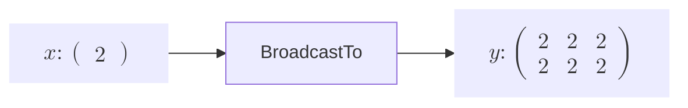
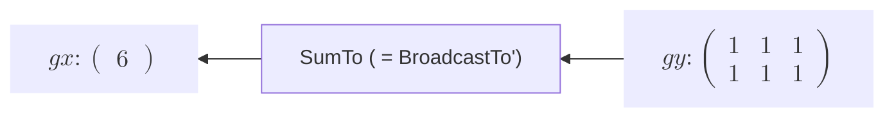
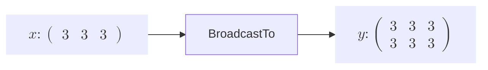
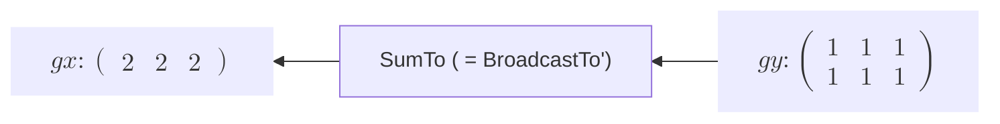

# BroadcastTo関数の実装
はじめに、ブロードキャストで形状を正しく変更する関数を**BroadcastTo** とします。
このブロードキャストの機能はArray型のメソッドである **broadcast()** によって成り立っています。このメソッドには引数として演算する際のもう片方の行列の形状を渡します。そして、その渡した形状が自身の行列の形状とブロードキャストで対応するか確かめ、うまく合う場合は自身の形状を変形させます。うまく合わない場合はエラーを返します。このメソッドを用いて、行列を変形させます。   

**BroadcastTo関数** を実装する前にひとつ確認しておかなくてはならないことがあります。それは**Backward** です。ここに二つの例を挙げました。

---

**BroadcastTo関数のForwardとBackward**

**Forward**


**Backward**


---

**もう一つの場合**

**Forward**


**Backward**


---

この二つは違う形状の **input** を同じ形状に変形させています。注目すべき点は**gx** の行列の値です。**BroadcastTo** でinputの行列の値をいわばコピーして拡張しています。なので、 **Backward** の場合はそのコピーを戻す形で足し合わせることで **gx** に戻します。

ここでBroadcastToで拡張した際、バックプロパゲーションでは要素を足すことを数学的に確かめます。 
$$
X:\begin{pmatrix}
x_0 & x_1 & x_2
\end{pmatrix}
\xrightarrow{BroadCastTo}
Y:\begin{pmatrix}
y_0 & y_1 & y_2 \\
y_3 & y_4 & y_5
\end{pmatrix} = 
\begin{pmatrix}
x_0 & x_1 & x_2 \\
x_0 & x_1 & x_2
\end{pmatrix}
$$

$$
\frac{\partial L}{\partial \bm{X}}:\begin{pmatrix}
\frac{\partial L}{\partial \bm{y}} \cdot \frac{\partial y}{\partial \bm{x_0}} & \frac{\partial L}{\partial \bm{y}} \cdot \frac{\partial y}{\partial \bm{x_1}} & \frac{\partial L}{\partial \bm{y}} \cdot \frac{\partial y}{\partial \bm{x_2}}
\end{pmatrix}
\xleftarrow{SumTo}
\frac{\partial L}{\partial \bm{Y}}:\begin{pmatrix}
\frac{\partial L}{\partial \bm{y_0}} & \frac{\partial L}{\partial \bm{y_1}} & \frac{\partial L}{\partial \bm{y_2}} \\
\frac{\partial L}{\partial \bm{y_3}} & \frac{\partial L}{\partial \bm{y_4}} & \frac{\partial L}{\partial \bm{y_5}}
\end{pmatrix}
$$
この際$x_0$の偏微分、$\frac{\partial L}{\partial \bm{x_0}} = \frac{\partial L}{\partial \bm{y}} \cdot \frac{\partial y}{\partial \bm{x_0}}$で考えてみます。$y$での偏微分ですが、この$y$は$x_0$に関係する$y$の要素なので、$y_0,y_3$を指します。よってこの部分は正確には$\frac{\partial L}{\partial \bm{x_0}} = \frac{\partial L}{\partial \bm{y_0}} \cdot \frac{\partial y_0}{\partial \bm{x_0}} + \frac{\partial L}{\partial \bm{y_3}} \cdot \frac{\partial y_3}{\partial \bm{x_0}}$ 
となります。ここで、$\frac{\partial y_0}{\partial \bm{x_0}}$と$\frac{\partial y_3}{\partial \bm{x_0}}$はただ値をコピーしただけ関係なのでそれぞれ1です。なので最終的に$\frac{\partial L}{\partial \bm{x_0}} = \frac{\partial L}{\partial \bm{y_0}}  + \frac{\partial L}{\partial \bm{y_3}}$ となります。これは$gy$の要素の和を取ったものです。

そして、このバックプロパゲーションを実装するにあたって、**gy** の要素を正しく足して**gx** を返す関数が必要となります。これがもう一つの関数、**SumTo** です。つまり、**SumTo関数** を実装しなければ **BroadcastTo関数** のバックプロパゲーションが実装できないのです。なので、下にあるBroadcastToのコードは次に説明する **SumTo関数** を見てからにしてください。 

```rust
struct BroadcastTo {
    inputs: Vec<RcVariable>,
    output: Option<Weak<RefCell<Variable>>>,
    shape: IxDyn,
    generation: i32,
    id: usize,
}

impl Function for BroadcastTo {
    fn call(&mut self) -> RcVariable {
        let inputs = &self.inputs;
        if inputs.len() != 1 {
            panic!("BroadcastToは一変数関数です。inputsの個数が一つではありません。")
        }

        let output = self.forward(inputs);

        if get_grad_status() == true {
            //inputのgenerationで一番大きい値をFuncitonのgenerationとする
            self.generation = inputs.iter().map(|input| input.generation()).max().unwrap();

            //  outputを弱参照(downgrade)で覚える
            self.output = Some(output.downgrade());

            let self_f: Rc<RefCell<dyn Function>> = Rc::new(RefCell::new(self.clone()));

            //outputsに自分をcreatorとして覚えさせる
            output.0.borrow_mut().set_creator(self_f.clone());
        }

        output
    }

    fn forward(&self, xs: &[RcVariable]) -> RcVariable {
        let x = &xs[0];

        let y_shape = self.shape.clone();

        // 実際の形状を `IxDynImpl` からスライスとして抽出

        let y_data = x.data().broadcast(y_shape).unwrap().mapv(|x| x.clone());

        y_data.rv()
    }

    fn backward(&self, gy: &RcVariable) -> Vec<RcVariable> {
        let x = &self.inputs[0];
        let x_shape = IxDyn(x.data().shape());

        let gx = sum_to(gy, x_shape);
        let gxs = vec![gx];

        gxs
    }

    fn get_inputs(&self) -> &[RcVariable] {
        &self.inputs
    }

    fn get_output(&self) -> RcVariable {
        let output;
        output = self
            .output
            .as_ref()
            .unwrap()
            .upgrade()
            .as_ref()
            .unwrap()
            .clone();

        RcVariable(output)
    }

    fn get_generation(&self) -> i32 {
        self.generation
    }
    fn get_id(&self) -> usize {
        self.id
    }
}
impl BroadcastTo {
    fn new(inputs: &[RcVariable], shape: IxDyn) -> Rc<RefCell<Self>> {
        Rc::new(RefCell::new(Self {
            inputs: inputs.to_vec(),
            output: None,
            shape: shape,
            generation: 0,
            id: id_generator(),
        }))
    }
}

fn broadcast_to_f(xs: &[RcVariable], shape: IxDyn) -> RcVariable {
    BroadcastTo::new(xs, shape).borrow_mut().call()
}


pub fn broadcast_to(x: &RcVariable, shape: IxDyn) -> RcVariable {
    let y = broadcast_to_f(&[x.clone()], shape);
    y
    let y;
    let x_shape = IxDyn(x.data().shape());
    if x_shape == shape {
        y = x.clone();
    } else {
        y = broadcast_to_f(&[x.clone()], shape);
    }

    y
}

pub fn sum_to(x: &RcVariable, shape: IxDyn) -> RcVariable {
    let y;
    let x_shape = IxDyn(x.data().shape());
    if x_shape == shape {
        y = x.clone();
    } else {
        y = sum_to_f(&[x.clone()], shape);
    }

    y
}
```
>この下の説明は次の **SumTo関数** の説明を読んでから進めてください。

引数としてこの形状に変形させたいという形状を渡し、 **shape** フィールドとして保持します。forwardで **broadcast** メソッドにその形状を渡すことで、ブロードキャストを実現します。ブロードキャストで返された行列は参照を渡すので、要素ごとにクローンして実体としてのデータを求めます。

**SumTo関数**も実装したら、 **BroadcastTo** 関数を二つの場合でテストしてみましょう。

TODO: コード検証必要
```rust
#[test]
    fn broadcast_to_test() {
        use crate::core_new::ArrayDToRcVariable;

        let x = array![3.0, 3.0, 3.0].rv();

        let mut y = broadcast_to(&x,Dim(IxDyn(&[2, 3])));

        println!("y = {}", y.data()); 

        y.backward(false);

        println!("x_grad = {:?}", x.grad().unwrap().data()); // 
    }
```