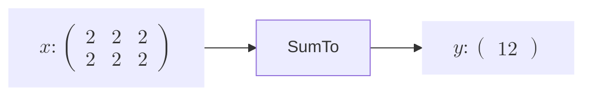
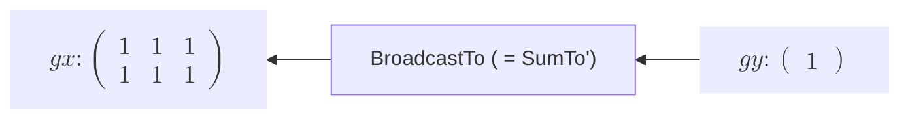
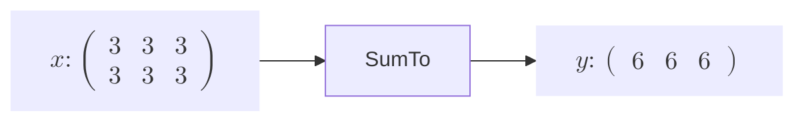
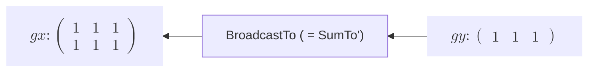

# SumTo関数の実装
先ほど、ブロードキャストで形状を正しく変更する関数を**BroadcastTo** を説明しました。その過程で、BroadcastTo関数のBackwardにおいて新たな関数、**SumTo** が必要になりました。ここではこの関数について解説します。  


ではこの**SumTo関数** のFowwardとBackwardを見てみましょう。すると、もうお気づきかもしれませんが、実は、**BroadcastTo**と**SumTo** は **ForwardとBackwardにおいて表裏一体の関係** なのです。

---

**SumTo関数のForwardとBackward**

**Forward**


**Backward**


---

**もう一つの場合**

**Forward**


**Backward**


---

これらのグラフと前のBroadcastToの時のグラフを比べて見ると、 **input** をブロードキャストで拡張したのを、**SumTo** で戻し、逆に**SumTo** で和を取ったものを、**BroadcastTo** で拡張して戻すというお互いに依存しあう関係になっています。なので、**これら二つの関数を実装する際は同時に実装する必要があります。**
 

```rust
struct SumTo {
    inputs: Vec<RcVariable>,
    output: Option<Weak<RefCell<Variable>>>,
    shape: IxDyn,
    generation: i32,
    id: usize,
}

impl Function for SumTo {
    fn call(&mut self) -> RcVariable {
        let inputs = &self.inputs;
        if inputs.len() != 1 {
            panic!("SumToは一変数関数です。inputsの個数が一つではありません。")
        }

        let output = self.forward(inputs);

        if get_grad_status() == true {
            //inputのgenerationで一番大きい値をFuncitonのgenerationとする
            self.generation = inputs.iter().map(|input| input.generation()).max().unwrap();

            //  outputを弱参照(downgrade)で覚える
            self.output = Some(output.downgrade());

            let self_f: Rc<RefCell<dyn Function>> = Rc::new(RefCell::new(self.clone()));

            //outputsに自分をcreatorとして覚えさせる
            output.0.borrow_mut().set_creator(self_f.clone());
        }

        output
    }

    fn forward(&self, xs: &[RcVariable]) -> RcVariable {
        let x = &xs[0];
        let y_shape = self.shape.clone();
        let y_data = array_sum_to(&x.data().view(), y_shape);

        y_data.rv()
    }

    fn backward(&self, gy: &RcVariable) -> Vec<RcVariable> {
        let x = &self.inputs[0];

        let x_shape = IxDyn(x.data().shape());

        let gx = broadcast_to(gy, x_shape);
        let gxs = vec![gx];

        gxs
    }

    fn get_inputs(&self) -> &[RcVariable] {
        &self.inputs
    }

    fn get_output(&self) -> RcVariable {
        let output;
        output = self
            .output
            .as_ref()
            .unwrap()
            .upgrade()
            .as_ref()
            .unwrap()
            .clone();

        RcVariable(output)
    }

    fn get_generation(&self) -> i32 {
        self.generation
    }
    fn get_id(&self) -> usize {
        self.id
    }
}
impl SumTo {
    fn new(inputs: &[RcVariable], shape: IxDyn) -> Rc<RefCell<Self>> {
        Rc::new(RefCell::new(Self {
            inputs: inputs.to_vec(),
            output: None,
            shape: shape,
            generation: 0,
            id: id_generator(),
        }))
    }
}

fn array_sum_to(x_array: &ArrayViewD<f32>, shape: IxDyn) -> ArrayD<f32> {
    let x_shape = x_array.shape();

    let mut axes_to_sum = HashSet::new();

    // 合計する軸を特定する
    for i in 0..x_shape.len() {
        if i >= shape.ndim() || x_shape[i] != shape[i] {
            axes_to_sum.insert(i);
        }
    }

    let mut y = x_array.to_owned();

    // HashSetの要素をVecに収集し、ソートして逆順にイテレーションする
    let mut sorted_axes: Vec<_> = axes_to_sum.into_iter().collect();
    sorted_axes.sort_unstable();

    // 特定した軸を合計する
    for &axis in sorted_axes.iter().rev() {
        y = y.sum_axis(Axis(axis)).insert_axis(Axis(axis));
    }

    y
}

fn sum_to_f(xs: &[RcVariable], shape: IxDyn) -> RcVariable {
    SumTo::new(xs, shape).borrow_mut().call()
}

pub fn sum_to(x: &RcVariable, shape: IxDyn) -> RcVariable {
    let y;
    let x_shape = IxDyn(x.data().shape());
    if x_shape == shape {                 // 形状が変化しないならそのまま流す
        y = x.clone();
    } else {
        y = sum_to_f(&[x.clone()], shape);
    }

    y
}
```
基本的にはBroadcastTo関数と同様に、引数として求める形状を渡します。しかし、違う点は**BroadcastTo** を実際に処理するメソッド、`broadcast()` が**Array型** には装備されていたのに対して、**sumto** というメソッドは現状実装されていません。つまり、自分でその処理を書かなければなりません。その処理が `array_sum_to()` です。この処理については詳しくは解説しませんが、簡単な説明として、inputの行列のある軸に対して和をとる際、求める形状の軸に対してどこが違うのか、すなわちどの軸を対象とすべきかという軸を求め、それを配列として保持し、その軸において`sum_axis()` メソッドで和をとります。また、`sum_to()` 関数では、形状が変化しない場合は、そのまま流すようにします。

**BroadcastTo**も実装したら、  **SumTo関数**関数を二つの場合でテストしてみましょう。


```rust
#[test]
    fn sum_to_test() {
        use crate::core_new::ArrayDToRcVariable;

        let x = array![[3.0, 3.0, 3.0],[ 3.0, 3.0,3.0]].rv();

        let mut y = sum_to(&x,Dim(IxDyn(&[1, 3])));

        println!("y = {}", y.data()); 

        y.backward(false);

        println!("x_grad = {:?}", x.grad().unwrap().data()); 
    }
```