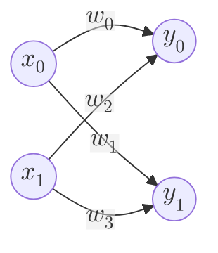
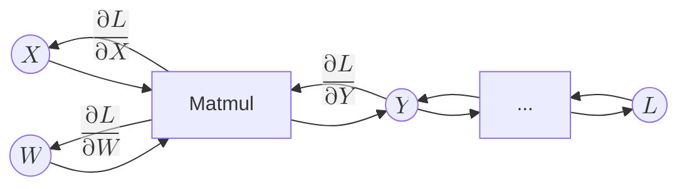

# MatMul関数の実装
行列計算において非常に重要な計算として行列積があります。行列積はベクトルによるベクトル積の拡張であり、深層学習の線形変換、ひいては全結合型のニューラルネットワークを構築するという重要な役割を果たしています。
このドキュメントを読んでいる方はすでに行列の扱い方に詳しいと思いますが、ここで改めて行列積について考え、さらに行列積のバックプロパゲーションの原理を導き出しましょう。   

はじめに、行列積を深層学習でなぜ用いるのか考えてみましょう。


これはニューラルネットワークの基本となるニューロンの図式です。これらの関係は、
入力の\\(X = (x_0,x_1)\\)、重みの\\(W\\)、出力の\\(Y = (y_0,y_1)\\)が存在しますが、出力と入力の関係は、\\(y_0 = x_0\cdot w_0 + x_1\cdot w_2\\)、\\(y_1 = x_0\cdot w_1 + x_1\cdot w_3\\) というような数式で表せます。これはまさに、

$$(y_0,y_1) = (x_0,x_1)*
\begin{pmatrix}
w_0 & w_1 \\\\
w_2 & w_3 
\end{pmatrix}
$$   
という行列積の計算です。このとき$X$はベクトルですが、入力の値が複数あった場合、$X$を行列として拡張すれば、行列積という一つの関係式で表せることができます。これらのニューロンは一つでは表現できる式は浅いものとなってしまいます。このニューロンがたくさんつながりあい、深い層となって深い表現が可能となり、精度向上につながるのです。そして、**たくさんあるニューロンの計算を効率よく行う手段として行列積を用いるということです。**

ではこの行列積を実現するFunction構造体を実装していきます。はじめに行列積を扱う関数**MatMul**の式の関係はこのようになります。




まず行列積\\(Y = X\cdot W\\)という関数を考えます。行列積という演算は非可換(\\(a\cdot b \ne b\cdot a\\))なので、かける順番を\\(X,W\\)という順番で正確に定義しておきます。なので引数として行列を渡す際、順番を考えて渡さなくてはなりません。そうでなければ、順伝播、逆伝播においても計算結果が異なってしまいます。  

この行列積を行う計算処理はArray型で装備されているので、試しに使用してみましょう。     

  


```rust
fn main() {
    let a = array![[1.0, 2.0, 3.0], [4.0, 5.0, 6.0]];
    let b = array![[7.0, 8.0], [9.0, 10.0], [11.0, 12.0]];
    let c = a.dot(&b);

    println!("{}", c);
}
```

このとき、\\(c = a\cdot b\\) なので、   
$$
\begin{pmatrix}
58 & 64  \\\\
139 & 154  
\end{pmatrix} =
\begin{pmatrix}
1 & 2 & 3 \\\\
4 & 5 & 6
\end{pmatrix} \cdot
\begin{pmatrix}
7 & 8 \\\\
9 & 10 \\\\
11 & 12
\end{pmatrix} 
$$

このように、Array型の `dot()` メソッドを使えば、簡単に行列積を求められます。

>Array型で提供される**dotメソッド**は2次元の行列までしか対応していません。よって、**Matmul関数**も2次元の行列のみに対応します。3次元の行列積、いわゆる**テンソル積** は**CNN**といった機能で必要となるため、今後**TensorDot** として別のFunction構造体を定義します。   

では次に行列積のバックプロパゲーションを考えてみます。はじめに各変数の偏微分の式はこのようになります。

$$
\begin{align}
\frac{\partial L}{\partial X} = \frac{\partial L}{\partial Y} \cdot W^\mathsf{T}\\\\
\frac{\partial L}{\partial W} = X^\mathsf{T} \cdot \frac{\partial L}{\partial Y}
\end{align}
$$   

転置行列などが用いられるなど、直感に反する面があります。この式に登場する\\(\frac{\partial L}{\partial Y}\\)は上流からきた微分の値を指します。     

本来ならば、この偏微分の式を一からこの場で解説したいところですが、筆者である私自身、*LaTeX*の記法に慣れていないので、この説明に関してはより詳しく、そしてわかりやすく解説しているサイトにゆだねたいと思います。これに関しては、一度自分の手で実際に数式などを考え、偏微分で転置行列が出てくるところなどを試していただきたいです。   

- [行列積の勾配を誤差逆伝播法により求める](https://zenn.dev/schnell/articles/579df242f79964)
- [深層学習／行列積の誤差逆伝播](https://qiita.com/jun40vn/items/de5ddeca4962edbd1bc2)

偏微分の数学的な説明を省略してしまいましたが、ここで確認してほしい重要な点は、**形状の確認**です。行列積はあらゆる行列の組み合わせにおいて行える計算処理ではありません。二つの行列には、形状においてある条件を満たしていなければいけません。   

$$(y_0,y_1) = (x_0,x_1)*
\begin{pmatrix}
w_1 & w_2 \\\\
w_3 & w_4 
\end{pmatrix}
$$
この時、\\(y_0\\)はいわばベクトル\\((x_0,x_1)\\)とベクトル\\((w_1,w_3)\\)のベクトル積です。ベクトル積で求めるということではこの二つのベクトルの長さは等しくなければなりません。つまり**前の行列の列数と後の行列の行数が一致していなければならないという条件**が必要です。これがまさに、行列積を行える形状の条件です。これを一般化してみます。  

形状が\\((k,l)\\)の行列\\(A\\)と、\\((m,n)\\)の行列\\(B\\)における行列積では、\\(A\\)の列数と\\(B\\)の行数、すなわ\\(l\\)と\\(m\\)が一致していなければなりません。またこの条件を満たしたうえで、行列積を行った場合の出力の行列\\(C\\)の形状は\\((k,n)\\)となります。出力の形状がこのようになるのは明らかなので証明は省略します。

この考えを用いれば、行列のバックプロパゲーションで重要な変数のdataとgradの形状の一致も先ほどの偏微分の式から分かります。つまり、\\(\frac{\partial L}{\partial X}\\)は\\(X\\)と、\\(\frac{\partial L}{\partial W}\\)は\\(W\\)と形状が一致するということです。    

前置きが長くなりましたが、それでは**MatMul構造体**を実装してみます。

```rust
struct MatMul {
    inputs: Vec<RcVariable>,
    output: Option<Weak<RefCell<Variable>>>,
    generation: i32,
    id: usize,
}

impl Function for MatMul {
    fn call(&mut self) -> RcVariable {
        let inputs = &self.inputs;
        if inputs.len() != 2 {
            panic!("Matmulは二変数関数です。inputsの個数が二つではありません。")
        }

        let output = self.forward(inputs);

        if get_grad_status() == true {
            //inputのgenerationで一番大きい値をFuncitonのgenerationとする
            self.generation = inputs.iter().map(|input| input.generation()).max().unwrap();

            //  outputを弱参照(downgrade)で覚える
            self.output = Some(output.downgrade());

            let self_f: Rc<RefCell<dyn Function>> = Rc::new(RefCell::new(self.clone()));

            //outputsに自分をcreatorとして覚えさせる
            output.0.borrow_mut().set_creator(self_f.clone());
        }

        output
    }

    fn forward(&self, xs: &[RcVariable]) -> RcVariable {
        //xs[0]の方をX, xs[1]の方をWとする
        let x = &xs[0];
        let w = &xs[1];

        let x_data = x.data();
        let w_data = w.data();

        //match以降の場合分けを関数にしたい
        let y_data = array_matmul(&x_data.view(), &w_data.view());

        y_data.rv()
    }

    fn backward(&self, gy: &RcVariable) -> Vec<RcVariable> {
        let x = &self.inputs[0];
        let w = &self.inputs[1];

        let gx = matmul(gy, &w.t());
        let gw = matmul(&x.t(), gy);
        let gxs = vec![gx, gw];

        gxs
    }

    fn get_inputs(&self) -> &[RcVariable] {
        &self.inputs
    }

    fn get_output(&self) -> RcVariable {
        let output;
        output = self
            .output
            .as_ref()
            .unwrap()
            .upgrade()
            .as_ref()
            .unwrap()
            .clone();

        RcVariable(output)
    }

    fn get_generation(&self) -> i32 {
        self.generation
    }
    fn get_id(&self) -> usize {
        self.id
    }
}
impl MatMul {
    fn new(inputs: &[RcVariable]) -> Rc<RefCell<Self>> {
        Rc::new(RefCell::new(Self {
            inputs: inputs.to_vec(),
            output: None,
            generation: 0,
            id: id_generator(),
        }))
    }
}

pub fn array_matmul(x_array: &ArrayViewD<f32>, w_array: &ArrayViewD<f32>) -> ArrayD<f32> {
    let y = match (x_array.ndim(), w_array.ndim()) {
        // 1D × 1D → スカラー出力
        (1, 1) => {
            let x = x_array.clone().into_dimensionality::<Ix1>().unwrap();
            let w = w_array.clone().into_dimensionality::<Ix1>().unwrap();

            let y = x.dot(&w);
            ArrayD::from_elem(ndarray::IxDyn(&[]), y) // スカラーとして返す
        }

        // 2D × 1D
        (2, 1) => {
            let x = x_array.clone().into_dimensionality::<Ix2>().unwrap();
            let w = w_array.clone().into_dimensionality::<Ix1>().unwrap();
            let y = x.dot(&w);
            y.into_dyn()
        }

        // 1D × 2D
        (1, 2) => {
            let x = x_array.clone().into_dimensionality::<Ix1>().unwrap();
            let w = w_array.clone().into_dimensionality::<Ix2>().unwrap();
            let y = x.dot(&w);
            y.into_dyn()
        }

        // 2D × 2D
        (2, 2) => {
            let x = x_array.clone().into_dimensionality::<Ix2>().unwrap();
            let w = w_array.clone().into_dimensionality::<Ix2>().unwrap();
            let y = x.dot(&w);
            y.into_dyn()
        }

        _ => {
            panic!("3次元以上の行列積は未実装");
        }
    };

    y
}

fn matmul_f(xs: &[RcVariable]) -> RcVariable {
    MatMul::new(xs).borrow_mut().call()
}

pub fn matmul(x: &RcVariable, w: &RcVariable) -> RcVariable {
    let y = matmul_f(&[x.clone(), w.clone()]);
    y
}
```
基本的には **Add** や **Mul** といった二変数関数の変数を **X,W** に変更し、Array型の **dotメソッド** を用いて計算を行うというのが主な変更点です。注意したい点は **backward** と **dot** の処理方法です。


backwardの方は先ほどの偏微分の式に当てはめて計算します。\\(\frac{\partial L}{\partial X} = \frac{\partial L}{\partial Y} \cdot W^\mathsf{T}\\)の場合、上流からきた微分の値である\\(\frac{\partial L}{\partial Y}\\)と\\({W}^\mathsf{T}\\)の行列積を行います。\\(\frac{\partial L}{\partial  W}\\)も同様です。  

Array型のメソッドの `dot` は実は静的な形状のArray型にしか対応していません。私はこのニューラルネットワークにおいて行列は動的な形状である **ArrayD** として扱ってきたため、そのまま代入することはできません。よって `fn array_matmul()` 関数定義して用いることで動的な行列を静的に変更します。静的にするため、場合分けし、 `into_dimensionality()` で静的に変換します。私たちは動的な行列を基本としｔますので、dot計算したあとは `into_dyn()` で再び動的に戻します。これらの変換はパフォーマンスにはほとんど影響を及ぼしません。 


では実装した **Matmul** 関数をテストしてみましょう。二変数ということに注目してください。

```rust
#[test]
    fn matmul_test() {
        use crate::core_new::ArrayDToRcVariable;

        let a = array![[1.0, 2.0, 3.0], [4.0, 5.0, 6.0]].rv();

        let b = array![[7.0, 8.0], [9.0, 10.0], [11.0, 12.0]].rv();

        let mut y = matmul(&a, &b);

        println!("y = {}", y.data()); // [[58,64],[139,154]]
        y.backward(false);

        println!("a_grad = {:?}", a.grad().unwrap().data());
        println!("b_grad = {:?}", b.grad().unwrap().data());
    }
```