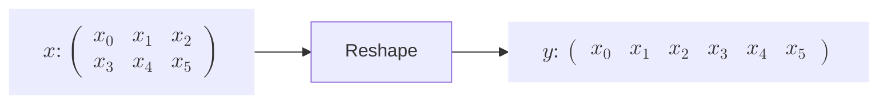
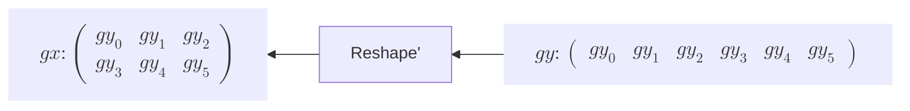

# Reshape関数の実装





reshape関数は行列の形状だけを変更する関数です。つまり数値計算を行わず、値をそのまま流すだけなので、微分の値は1であり、上流からきた微分の値をそのまま流します。このような微分が1の関数は今後も行列計算では出てきます。ここで重要なことは、**返す微分の行列はinputの行列と同じ形状でなければならないことです。** つまり、**xとgx、yとgyの形状はそれぞれ一致していなければなりません。** なので、**backward**の場合、形状を戻して渡す必要があるのです。
```rust
struct Reshape {
    inputs: Vec<RcVariable>,
    output: Option<Weak<RefCell<Variable>>>,
    shape: IxDyn,
    generation: i32,
    id: usize,
}

impl Function for Reshape {
    fn call(&mut self) -> RcVariable {
        let inputs = &self.inputs;
        if inputs.len() != 1 {
            panic!("Reshapeは一変数関数です。inputsの個数が一つではありません。")
        }

        let output = self.forward(inputs);

        if get_grad_status() == true {
            //inputのgenerationで一番大きい値をFuncitonのgenerationとする
            self.generation = inputs.iter().map(|input| input.generation()).max().unwrap();

            //  outputを弱参照(downgrade)で覚える
            self.output = Some(output.downgrade());

            let self_f: Rc<RefCell<dyn Function>> = Rc::new(RefCell::new(self.clone()));

            //outputsに自分をcreatorとして覚えさせる
            output.0.borrow_mut().set_creator(self_f.clone());
        }

        output
    }

    fn forward(&self, xs: &[RcVariable]) -> RcVariable {
        let x = &xs[0];
        let y_shape = self.shape.clone();
        let y_data = x.data().to_shape(y_shape).unwrap().to_owned();

        y_data.rv()
    }

    fn backward(&self, gy: &RcVariable) -> Vec<RcVariable> {
        let x = &self.inputs[0];
        let x_shape = IxDyn(x.data().shape());
        let gx = reshape(gy, x_shape);
        let gxs = vec![gx];

        gxs
    }

    fn get_inputs(&self) -> &[RcVariable] {
        &self.inputs
    }

    fn get_output(&self) -> RcVariable {
        let output;
        output = self
            .output
            .as_ref()
            .unwrap()
            .upgrade()
            .as_ref()
            .unwrap()
            .clone();

        RcVariable(output)
    }

    fn get_generation(&self) -> i32 {
        self.generation
    }
    fn get_id(&self) -> usize {
        self.id
    }
}
impl Reshape {
    fn new(inputs: &[RcVariable], shape: IxDyn) -> Rc<RefCell<Self>> {
        Rc::new(RefCell::new(Self {
            inputs: inputs.to_vec(),
            output: None,
            shape: shape,
            generation: 0,
            id: id_generator(),
        }))
    }
}

fn reshape_f(xs: &[RcVariable], shape: IxDyn) -> RcVariable {
    Reshape::new(xs, shape).borrow_mut().call()
}

pub fn reshape(x: &RcVariable, shape: IxDyn) -> RcVariable {
    let y = reshape_f(&[x.clone()], shape);
    y
}
```
**backward** で形状を戻すために、inputの形状を覚えておく必要がありますが、inputのデータは保持しており、そこから呼び出せばよいので特に考えません。  

変形させたい形状を引数として受け取るために、呼び出す関数の引数に **shape** を設定します。このshapeの型は **IxDyn** で動的な形状を指します。また、それを保持するために、**shapeフィールド** を持ちます。フィールドとして保持し、forwardでinputのArrayのデータの形状を変形します。backwardでは上流からきた微分の値である **gy** をinputの形状に変形させるために、xを呼び出して形状を求め、それによって変形させます。backward内の **reshape** 関数は今まさに実装している **Reshape構造体** です。   

では実装した **Reshape** 関数をテストしてみましょう。微分の値や形状などに着目してください。

```rust
#[test]
    fn reshape_test() {
        use crate::core_new::ArrayDToRcVariable;

        let a = array![[1.0, 2.0, 3.0], [4.0, 5.0, 6.0]].rv();
        let b = array![[1.0, 2.0, 3.0], [4.0, 5.0, 6.0]].rv();

        let mut y0 = reshape(&a, Dim(IxDyn(&[1, 6])));

        let mut y1 = b.reshape(Dim(IxDyn(&[1, 6])));

        println!("y0 = {}", y0.data()); //[[1,2,3,4,5,6]] shape(1,6)
        println!("y1 = {}", y1.data()); //[[1,2,3,4,5,6]] shape(1,6)

        y0.backward(false);
        y1.backward(false);
        println!("a_grad = {:?}", a.grad().unwrap().data()); // [[1.0,1.0,1.0],[1.0,1.0,1.0]] shape(2,3)
        println!("b_grad = {:?}", b.grad().unwrap().data()); // [[1.0,1.0,1.0],[1.0,1.0,1.0]] shape(2,3)
    }
```
すると、上の図のようにaとa_gradの形状が一致しているのがわかります。