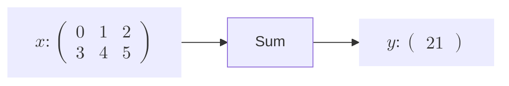
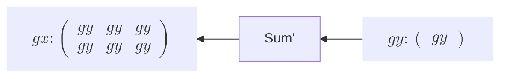
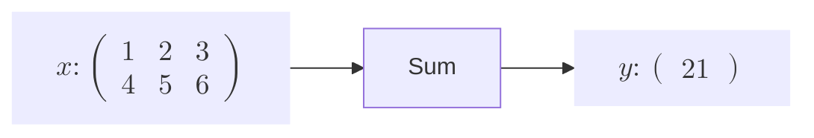
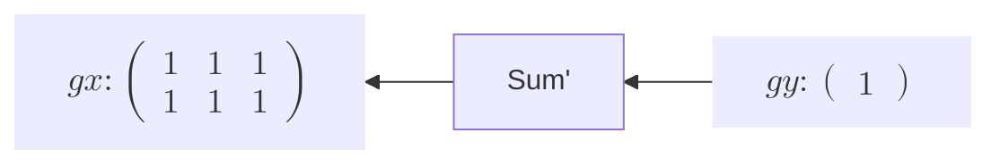
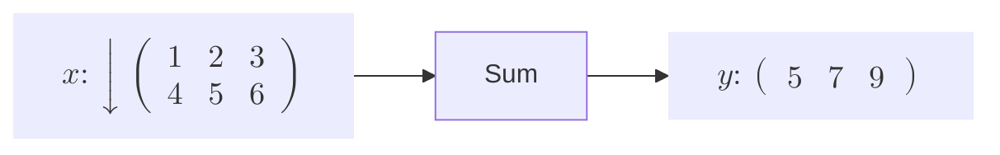
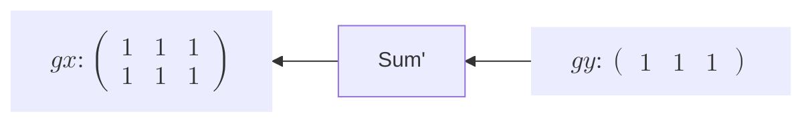
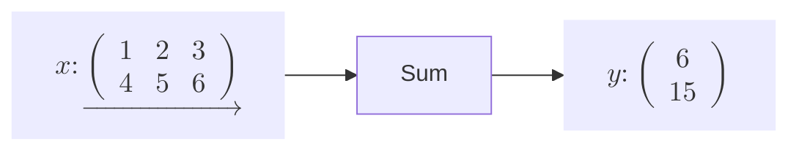
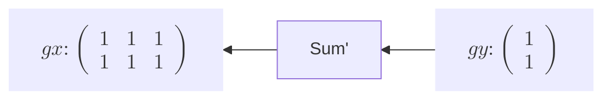

# Sum関数の実装





Sum関数はinputの行列のを合計値を計算し、スカラーとして出力する関数です。この関数は足し算として数値計算を行う関数ですが、$y=x_0+x_1+x_2+x_3+x_4+x_5$なので、$\frac{\partial y}{\partial x_k}=1$となり、**gy** はすべて1となります。微分の原理はReshapeと同じです。繰り返し話しますが、行列計算におけるバックプロパゲーションの重要なところは、形状が一致するように戻すことです。
   


**Sum関数** は行列の要素の和を足し合わせてそれを返す関数です。このとき要素数が減るので、自然と形状は変化しますが、ここで重要なのがどの要素をどのように足すかということです。具体的には軸を指定することでいくつかの足し方を表すことができます。   
ここで軸を指定したときのいくつかの例を見てみましょう。

---

① 軸指定なし




---

② 軸(axis) = 0




---

③ 軸(axis) = 1




ここでは2次元の行列におけるSum関数を例に挙げました。軸の指定とは、その軸に沿って要素を足すことです。上の図の **x** の行列には矢印が書かれていますが、その矢印の向きに足すということです。例えば、軸=0のとき、縦を表すのでその軸に沿って足すと形状は、(2,3) → (1,3)となります。軸1も同じ考え方です。   

>軸の指定の方法について、今後も多く扱うため、このドキュメントに関して統一しておきたいと思います。ある行列の形状が(m,n)の場合、この配列のインデックスで軸を決めます。軸＝0ならmを、1ならnを指します。このように定義すれば、これから3次元以上となったとしても一般化して規則的に扱うことができます。   


```rust
struct Sum {
    inputs: Vec<RcVariable>,
    output: Option<Weak<RefCell<Variable>>>,
    axis: Option<u16>,
    generation: i32,
    id: usize,
}

impl Function for Sum {
    fn call(&mut self) -> RcVariable {
        let inputs = &self.inputs;
        if inputs.len() != 1 {
            panic!("Sumは一変数関数です。inputsの個数が一つではありません。")
        }

        let output = self.forward(inputs);

        if get_grad_status() == true {
            //inputのgenerationで一番大きい値をFuncitonのgenerationとする
            self.generation = inputs.iter().map(|input| input.generation()).max().unwrap();

            //  outputを弱参照(downgrade)で覚える
            self.output = Some(output.downgrade());

            let self_f: Rc<RefCell<dyn Function>> = Rc::new(RefCell::new(self.clone()));

            //outputsに自分をcreatorとして覚えさせる
            output.0.borrow_mut().set_creator(self_f.clone());
        }

        output
    }

    fn forward(&self, xs: &[RcVariable]) -> RcVariable {
        let x = &xs[0];
        let axis = self.axis;

        let y_data;

        if let Some(axis_data) = axis {
            if axis_data != 0 && axis_data != 1 {
                panic!("axisは0か1の値のみ指定できます")
            }

            y_data = x
                .data()
                .sum_axis(Axis(axis_data as usize))
                .insert_axis(Axis(axis_data as usize));
        } else {
            let scalar_y = x.data().sum();
            y_data = array![scalar_y].into_dyn();
        }

        y_data.rv()
    }

    fn backward(&self, gy: &RcVariable) -> Vec<RcVariable> {
        let x = &self.inputs[0];
        let x_shape = IxDyn(x.data().shape());
        let gx = broadcast_to(gy, x_shape);
        let gxs = vec![gx];

        gxs
    }

    fn get_inputs(&self) -> &[RcVariable] {
        &self.inputs
    }

    fn get_output(&self) -> RcVariable {
        let output;
        output = self
            .output
            .as_ref()
            .unwrap()
            .upgrade()
            .as_ref()
            .unwrap()
            .clone();

        RcVariable(output)
    }

    fn get_generation(&self) -> i32 {
        self.generation
    }
    fn get_id(&self) -> usize {
        self.id
    }
}
impl Sum {
    fn new(inputs: &[RcVariable], axis: Option<u16>) -> Rc<RefCell<Self>> {
        Rc::new(RefCell::new(Self {
            inputs: inputs.to_vec(),
            output: None,
            axis: axis,

            generation: 0,
            id: id_generator(),
        }))
    }
}

fn sum_f(xs: &[RcVariable], axis: Option<u16>) -> RcVariable {
    Sum::new(xs, axis).borrow_mut().call()
}

pub fn sum(x: &RcVariable, axis: Option<u16>) -> RcVariable {
    let y = sum_f(&[x.clone()], axis);
    y
}
```
このsum関数の軸指定は **Array型** にsumメソッドとして標準装備されているので、そのまま使用します。軸指定の値は **Option&lt;u16&gt;** としてフィールドで保持します。 **None** が軸指定なし、0,1という整数の数字が軸の値を指します。ここで軸の数値について、軸の個数、すなわち次元数以上の軸は指定できないので、それ以上の値は渡せないように **panicやResult型** で設定します。Sum関数は2次元の行列を対象としています。今回の場合、2次元なので0から数えて1までの二つまで指定できます。よって2以上の値は指定できません。


 

では実装した **Sum** 関数を上の3つの場合に分けてテストしてみましょう。微分の値や形状などに着目してください。

```rust
#[test]
    fn sum_test() {
        use crate::core_new::ArrayDToRcVariable;

        let a = array![[1.0, 2.0, 3.0], [4.0, 5.0, 6.0]].rv();
        let b = array![[1.0, 2.0, 3.0], [4.0, 5.0, 6.0]].rv();
        let c = array![[1.0, 2.0, 3.0], [4.0, 5.0, 6.0]].rv();

        let mut y0 = sum(&a, None);
        let mut y1 = sum(&b, Some(0));
        let mut y2 = sum(&c, Some(1));

        println!("y0 = {}", y0.data()); // 21.0
        println!("y1 = {}", y1.data()); //
        println!("y2 = {}", y2.data()); //

        y0.backward(false);
        y1.backward(false);
        y2.backward(false);

        println!("a_grad = {:?}", a.grad().unwrap().data()); //
        println!("b_grad = {:?}", b.grad().unwrap().data()); //
        println!("c_grad = {:?}", c.grad().unwrap().data()); //
    }
```
すると、上の図のように求めるgxと一致しているのがわかります。

