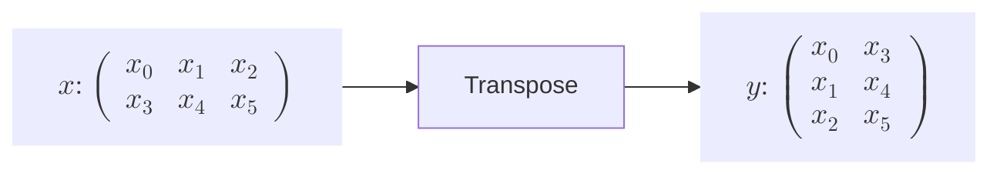
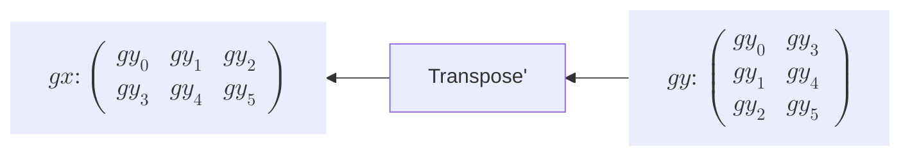

# Transpose関数の実装





Transpose関数はinputの行列の転置行列を返す関数です。この関数も形状を変更するだけの関数であり、微分といった原理はReshapeと同じです。繰り返し話しますが、行列計算におけるバックプロパゲーションの重要なところは、形状が一致するように戻すことです。
```rust
struct Transpose {
    inputs: Vec<RcVariable>,
    output: Option<Weak<RefCell<Variable>>>,
    generation: i32,
    id: usize,
}

impl Function for Transpose {
    fn call(&mut self) -> RcVariable {
        let inputs = &self.inputs;
        if inputs.len() != 1 {
            panic!("Transposeは一変数関数です。inputsの個数が一つではありません。")
        }

        let output = self.forward(inputs);

        if get_grad_status() == true {
            //inputのgenerationで一番大きい値をFuncitonのgenerationとする
            self.generation = inputs.iter().map(|input| input.generation()).max().unwrap();

            //  outputを弱参照(downgrade)で覚える
            self.output = Some(output.downgrade());

            let self_f: Rc<RefCell<dyn Function>> = Rc::new(RefCell::new(self.clone()));

            //outputsに自分をcreatorとして覚えさせる
            output.0.borrow_mut().set_creator(self_f.clone());
        }

        output
    }

    fn forward(&self, xs: &[RcVariable]) -> RcVariable {
        let x = &xs[0];
        let y_data = x.data().t().to_owned();

        y_data.rv()
    }

    fn backward(&self, gy: &RcVariable) -> Vec<RcVariable> {
        let gxs = vec![gy.t().to_owned()];

        gxs
    }

    fn get_inputs(&self) -> &[RcVariable] {
        &self.inputs
    }

    fn get_output(&self) -> RcVariable {
        let output;
        output = self
            .output
            .as_ref()
            .unwrap()
            .upgrade()
            .as_ref()
            .unwrap()
            .clone();

        RcVariable(output)
    }

    fn get_generation(&self) -> i32 {
        self.generation
    }
    fn get_id(&self) -> usize {
        self.id
    }
}
impl Transpose {
    fn new(inputs: &[RcVariable]) -> Rc<RefCell<Self>> {
        Rc::new(RefCell::new(Self {
            inputs: inputs.to_vec(),
            output: None,
            generation: 0,
            id: id_generator(),
        }))
    }
}

fn transpose_f(xs: &[RcVariable]) -> RcVariable {
    Transpose::new(xs).borrow_mut().call()
}

pub fn transpose(x: &RcVariable) -> RcVariable {
    let y = transpose_f(&[x.clone()]);
    y
}
```
転置行列の形状変更の手段は一つに決まっており、**backward** でも上流からきた微分の値を転置させればinputと同じ形状に戻るので特に形状を覚えるといった操作は必要ありません。

forwardでinputのArrayのデータの形状を転置行列として変形します。backwardでは上流からきた微分の値である **gy** を再び転置します。backward内の **gy.t()** は **Transpose構造体** をRcVariableのメソッドとして呼び出しています。   

では実装した **Transpose** 関数をテストしてみましょう。微分の値や形状などに着目してください。

```rust
#[test]
    fn transpose_test() {
        use crate::core_new::ArrayDToRcVariable;

        let a = array![[1.0, 2.0, 3.0], [4.0, 5.0, 6.0]].rv();
        let b = array![[1.0, 2.0, 3.0], [4.0, 5.0, 6.0]].rv();

        let mut y0 = transpose(&a);

        let mut y1 = b.t();

        println!("y0 = {}", y0.data()); //[[1,4],[2,5],[3,6]] shape(3,2)
        println!("y1 = {}", y1.data()); //[[1,4],[2,5],[3,6]] shape(3,2)

        y0.backward(false);
        y1.backward(false);
        println!("a_grad = {:?}", a.grad().unwrap().data()); // [[1.0,1.0,1.0],[1.0,1.0,1.0]] shape(2,3)
        println!("b_grad = {:?}", b.grad().unwrap().data()); // [[1.0,1.0,1.0],[1.0,1.0,1.0]] shape(2,3)
    }
```
すると、上の図のようにaとa_gradの形状が一致しているのがわかります。

>**Transpose関数** として軸を指定し、軸を入れ替える関数として定義されているものもあります。今回のこの転置という処理は軸0と軸1を入れ替えたものと捉えることもできます。これが3次元の行列などになると、3つの軸を入れ替えるという作業も必要となります。具体的には **CNN** の関数で使われます。そのような処理も正しくバックプロパゲーションできる関数を今後 **PermuteAxes** として別の関数で定義します。本来ならば、軸の入れ替えを統合的に行える処理をこの**Transpose** 関数で実装すべきでしたが、このような処理は複雑なため、分離させた方が良いと考えました。
