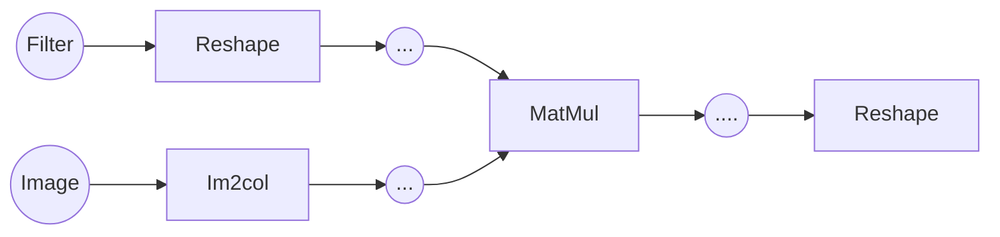

# Conv2d関数の理論

## 畳み込みの計算
Conv2d層では畳み込み演算を行います。この畳み込み演算の処理を行う関数を **Conv2d** とします。では初めにこの畳み込み演算で実際に行われる処理を見ていきます。

フィルターというものを用意し、それを画像に処理させます。この処理の流れは　\\(5 = 0\cdot 9 + 1\cdot 5 + 1\cdot 0 + 0\cdot 1\\)という計算になります。そして、このフィルターをスライドさせ、同じように計算した値を移動した場所の値とします。

ではCNNの根幹となる畳み込み演算を行うConv2d関数の処理の流れを見ていきます。先ほどの説明で、畳み込みの処理は、フィルターを移動させ、重なったピクセルの値を掛け合わせ、その値を合計するという処理でした。フィルターを動かすという物理的な説明になってしまいましたが、ではこの処理は行列計算ではどう実現するのでしょうか。早速Conv2dの構造を示します。

このグラフを見てもらうとわかるように、畳み込み層の一番の核となる計算は実はMatMul、すなわち行列積なのです。(正確にはテンソル積ですが、話の流れとして行列積として進めます。)入力画像であるImageをIm2colという特殊な関数で変形させ、それとカーネルとで行列積を取ることで、畳み込みの処理を実現することができるのです。このフィルターの移動の処理をどうして行列積で実現できるのか、Im2colから行列積までの一連の処理を考えていきます。なお、ここからはチャンネル数、バッチ数を踏まえたうえで解説します。

説明に入る前に、あらかじめそれぞれの変数が何を意味するのかをまとめておきます。

- \\(OC\\) : フィルター数
- \\(C\\) : チャンネル数
- \\(H\\) : 高さ
- \\(W\\) : 幅
- \\(KH\\) : フィルターの高さ
- \\(KW\\) : フィルターの幅
- \\(OH\\) : 出力の高さ
- \\(OW\\) : 出力の幅
- \\(N\\) : バッチ数

     

## フィルターのReshape
では最初にフィルターのreshapeについて説明します。フィルター数はフィルターの種類の数であり、自分で設定するものです。これらのフィルターを一列に変換し、2次元の行列とします。フィルターのサイズは\\((OC,C,KH,KW)\\)ですが、これに関しては次のIm2colの図で示されているので、そこを確認してください。もともとのフィルターのデータの集まりはこのように4次元なので、これを\\((OC,C\cdot KH\cdot KW\)\\)となるよう2次元にreshapeにします。なぜ2次元に変換するのかは、行列積のところで説明します。

## Im2col

続いて画像データのIm2colによる変形です。こちらはフィルターとは異なり、複雑な処理となります。

Im2colの主な処理は、画像データからフィルターが適用される範囲を抽出することです。図で示したフィルターの範囲を取り出し、一列にして出力の行列に追加します。出力の行列の高さの数が、フィルターの要素数と一致していることがわかります。次に考えるのは、抽出される個数です。フィルターの移動で値が抽出されるわけですが、その個数は前回のストライドとパディングの説明でした通り、二つの要素で求めることができました。これが\\((OH\cdot OW\)\\)です。抽出される個数は\\((OH\cdot OW\)\\)なので、横の長さはこのようになります。最後にバッチ数を考慮して、三次元になります。

## 行列積
ではいよいよ行列積の説明です。これら二つの変換により、行列積を行う準備が整いました。ここではイメージしやすいように、チャンネル数とバッチ数は省略します。

はじめに先ほどの畳み込み演算の計算を思い出してください。先ほどの説明の式は、\\(5 = 0\cdot 9 + 1\cdot 5 + 1\cdot 0 + 0\cdot 1\\)となっていたと思います。この形に見覚えはないでしょうか。これはまさにベクトル積の形です。フィルターの方を\\(w = (0,1,1,0)\\)、フィルターが適用される範囲のところを\\(x = (9,5,0,1)\\)とすれば、\\(5 = w\cdot x\\)で求められます。そしてこれを拡張すれば、行列積として扱えるのです。先ほどの説明の図を用いれば、フィルターのreshapeで説明した一次元にされたフィルターが\\(w\\)を、Im2colで説明したフィルターの適用範囲を一次元にしたものが\\(x\\)を表しているのです。この時、フィルターの幅と、抽出範囲の高さは\\((C\cdot KH\cdot KW\)\\)で一致しているので、行列積を行えます。

 

しかしここで一つ疑問が残ります。それは行列積は2次元の行列同士に適用される演算です。この場合、2次元と3次元で次元が合いません。そこで、新たに登場する演算が、 **テンソル積** です。これは行列積を拡張した3次元に対応する計算です。難しく感じますが、行う処理の基本は行列積であり、3次元の行列を指定された軸に沿ってスライスし、そのスライスされた2次元の行列と行列積を取るだけです。今回の場合、バッチを考慮するため、0の軸に沿ってスライスします。このようにすれば、画像ごとに行列積をとることができます。つまり、下の図の通り、一枚ずつ行列積を取っているのと同じです。

---

行列積で計算する理由は、行列計算は行列積に特化しているからです。for文でループさせることは行列計算においては苦手な手法です。行列を無理やり変形させてでも、行列積に落とし込んで計算させる価値があるということです。

最後にreshapeを用いて、出力された\\((N,OC,OH\cdot OW)\\)の行列を4次元の\\((N,OC,OH,OW)\\)に戻します。

次はPoolingについて、MaxPoolを例に挙げて説明します。