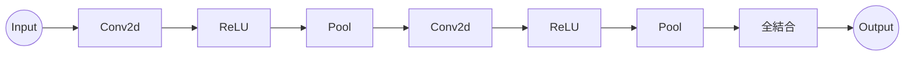

# CNNの理論

ではここからCNNの理論、構造について大まかな流れを説明します。はじめにCNNの層のネットワークの概略図を示します。これをあくまで一例なので、より複雑な構造に設計することも可能です。

一般的にCNNの構造は、Conv2dとPool層の間に活性関数を挟み、これを何個も重ねて深い層にすることが多いです。Conv2dは畳み込み演算を、Poolはプーリングを行う層です。この二つの層によって出力されたいわばその画像の特徴量を、今まで実装してきた全結合層で処理し、最終的に分類できる形に変換するのです。この二つの層(Conv2d,Pool)によって画像のサイズは縮小されていきます。この縮小されていく処理は様々な設定があり、それを一元的に管理できるLayerとして実装します。

## 畳み込み層

畳み込み層ではカーネル(フィルター)を用いて画像から特徴を検出します。この時使用される演算が畳み込み演算です。この処理に関しては[conv2dの理論](../CNN_riron/cnn_riron_conv.md)で詳しく解説します。

## プーリング層

プーリング層では通常畳み込み層の後に処理されるものです。プーリング層では画像をいくつかの領域に区分し、それぞれの領域を代表する値を返します。代表的なものは、MaxPoolとAveragePoolです。前者は領域内の値を最大値を返し、後者は平均値を返します。この処理に関しては[maxpoolingの理論](../CNN_riron/cnn_riron_pool.md)で詳しく解説します。

