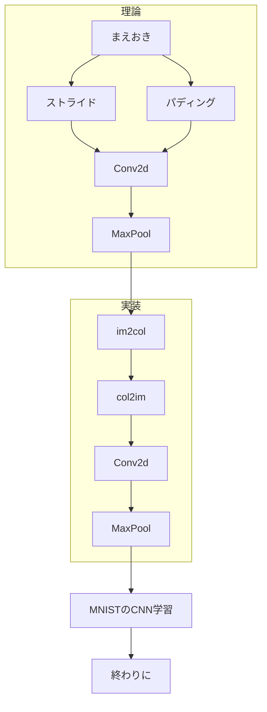

# はじめに

前回のドキュメント『基礎編』で深層学習のフレームワークの基礎を構築しました。土台となる基礎を築き上げ、さらなるフレームワーク、そして深層学習の理論の高みを目指して応用的な機能を追加していきます。今回は名前の通り、 **CNN** という画像認識の分野で活用されている機能を一から実装していきます。

## CNNとは
深層学習が人間の脳の神経細胞から着想を得たように、CNNは人間の視覚の仕組みをもとに設計されています。前回のMNISTの学習を思い出してください。私たちは画像データを一つのベクトルとして一次元に変換して学習させました。しかし、一列に並んだデータから数字の曲線などを感知することは難しいでしょう。そこでCNNは画像データを2次元として扱い、そこから特徴を抽出することで、より画像に対しての認識能力が向上します。前回の基本的な層、例えば全結合層などの一次元に対して今回は2次元と次元が高くなるので、複雑な処理計算が新たに求められます。

## 本書の構成

行列を複雑に変換する特殊な関数を使用するので、はじめにCNNの理論的な説明を行います。次にその説明した理論のもと、実際に実装していきます。パフォーマンスよりもなるべく理論を直感的に理解できるような設計にしています。